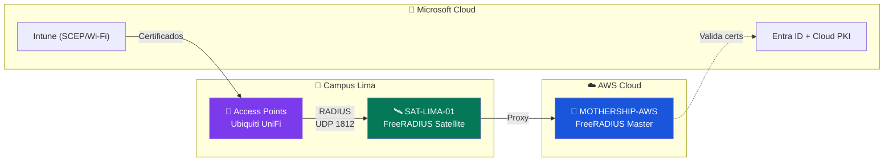

# UPeU Mothership RADIUS 🚀

Repositorio central de autenticación Wi-Fi empresarial para la **Universidad Peruana Unión**, basado en la metodología de [InkBridge Networks](https://www.inkbridgenetworks.com/blog/blog-10/radius-for-universities-122) y estándares **Cisco AAA**.

---

## 📐 Arquitectura



### Glosario

| Componente | IP | Rol |
|---|---|---|
| **MOTHERSHIP-AWS** | `54.166.108.154` | Servidor RADIUS Master (EAP-TLS + validación de certificados) |
| **SAT-LIMA-01** | `192.168.62.89` | Proxy RADIUS local con caché TLS para reconexiones rápidas |
| **Access Points** | `172.16.79.0/24` | Ubiquiti UniFi (sede Lima) |

---

## 🛠 Stack Tecnológico

| Capa | Tecnología |
|---|---|
| **Identity** | Microsoft Entra ID + Microsoft Cloud PKI |
| **Endpoint Management** | Microsoft Intune (SCEP / Wi-Fi profiles) |
| **Policy Server** | FreeRADIUS 3.2.x en AWS EC2 (Ubuntu 24.04 LTS) |
| **Satellites** | FreeRADIUS 3.2.x en Ubuntu (VMware local) |

---

## 📋 Cumplimiento

- **Authentication:** EAP-TLS (Certificados digitales)
- **Authorization:** Role-Based Access Control (RBAC) vía Entra Groups
- **Accounting:** Interim-Update centralizado en AWS

---

## 📁 Estructura del Repositorio

```
upeu-mothership-radius/
├── README.md
├── docs/
│   ├── 01-arquitectura/
│   │   └── flujo-autenticacion.md       # Diagrama y flujo Mothership ↔ Satellites
│   ├── 02-mothership-aws/
│   │   ├── despliegue-instancia.md      # Crear instancia EC2 + instalar FreeRADIUS
│   │   └── configuracion-radius.md      # EAP-TLS + Caché TLS + Zero Trust + Performance
│   ├── 03-satellites-locales/
│   │   ├── instalacion-ubuntu.md        # Instalación en VMware / Ubuntu
│   │   └── configuracion-proxy.md       # Reenvío de peticiones hacia AWS
│   ├── 04-identidad-y-pki/
│   │   ├── microsoft-entra-id.md        # App Registration y App Proxy
│   │   ├── cloud-pki-config.md          # Certificados Root CA e Issuing CA
│   │   └── perfiles-intune.md           # Perfiles SCEP y Wi-Fi (Checklist)
│   ├── 05-operaciones/
│   │   ├── monitoreo-logs.md            # tail, journalctl y verificación de caché
│   │   └── mantenimiento.md             # Rotación de logs y limpieza
│   ├── 06-troubleshooting/
│   │   └── errores-comunes.md           # Soluciones a problemas frecuentes
│   └── assets/
│       └── capturas/                    # Screenshots de Intune y configuración
├── infrastructure/
│   └── aws/                             # Código IaC (Terraform)
├── freeradius/
│   ├── clients.d/                       # Definición de APs Satélites
│   └── certs/                           # Certificados Cloud PKI
├── intune/
│   └── profiles/                        # Export de políticas Intune
└── .github/
    └── workflows/                       # CI/CD (GitHub Actions)
```

---

## 🚀 Guía de Inicio Rápido

1. **Arquitectura** → Leer [flujo-autenticacion.md](docs/01-arquitectura/flujo-autenticacion.md)
2. **Mothership** → Seguir [despliegue-instancia.md](docs/02-mothership-aws/despliegue-instancia.md) y luego [configuracion-radius.md](docs/02-mothership-aws/configuracion-radius.md)
3. **Satellite** → Seguir [instalacion-ubuntu.md](docs/03-satellites-locales/instalacion-ubuntu.md) y luego [configuracion-proxy.md](docs/03-satellites-locales/configuracion-proxy.md)
4. **Certificados** → Configurar [cloud-pki-config.md](docs/04-identidad-y-pki/cloud-pki-config.md) y [perfiles-intune.md](docs/04-identidad-y-pki/perfiles-intune.md)
5. **Operar** → Consultar [monitoreo-logs.md](docs/05-operaciones/monitoreo-logs.md) y [mantenimiento.md](docs/05-operaciones/mantenimiento.md)
6. **Problemas** → Ver [errores-comunes.md](docs/06-troubleshooting/errores-comunes.md)