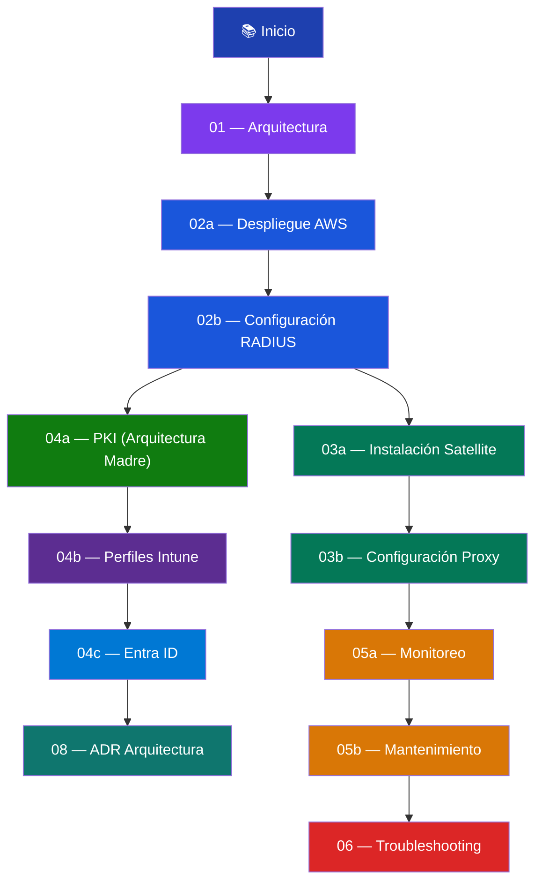

# 📚 Índice de Documentación — RADIUS UPeU

> **Última actualización:** 2026-03-02  
> **Metodología:** [InkBridge Networks — RADIUS for Universities](https://www.inkbridgenetworks.com/blog/blog-10/radius-for-universities-122)

---

## Mapa de Navegación

---

## Documentos por Sección

### 01 — Arquitectura

| Documento | Descripción | Estado |
|---|---|---|
| [flujo-autenticacion.md](01-arquitectura/flujo-autenticacion.md) | Visión general del sistema Mothership-Satellite, diagramas de flujo EAP-TLS, glosario de componentes y cachés | ✅ Completo |

### 02 — Mothership (AWS)

| Documento | Descripción | Estado |
|---|---|---|
| [despliegue-instancia.md](02-mothership-aws/despliegue-instancia.md) | Lanzamiento de instancia EC2, Security Group, Elastic IP, instalación de FreeRADIUS | ✅ Completo |
| [configuracion-radius.md](02-mothership-aws/configuracion-radius.md) | EAP-TLS, caché TLS, Session Tickets, BLASTRADIUS, thread pool, VLAN assignment, accounting | ✅ Completo |

### 03 — Satellites Locales

| Documento | Descripción | Estado |
|---|---|---|
| [instalacion-ubuntu.md](03-satellites-locales/instalacion-ubuntu.md) | Instalación de FreeRADIUS en Ubuntu (VMware local), prerrequisitos y modo debug | ✅ Completo |
| [configuracion-proxy.md](03-satellites-locales/configuracion-proxy.md) | Proxy puro, home server, pool, realms, health check, caché de atributos, logging | ✅ Completo |

### 04 — Identidad y PKI

| Documento | Descripción | Estado |
|---|---|---|
| [arquitectura-pki-mothership.md](04-identidad-y-pki/arquitectura-pki-mothership.md) | Rol de PKI en Mothership-Satellite, flujo EAP-TLS, integración FreeRADIUS ↔ PKI ↔ Intune/Entra y límites de este repositorio | ✅ Completo |
| [cloud-pki-config.md](04-identidad-y-pki/cloud-pki-config.md) | Referencia histórica de configuración PKI en pilotos iniciales | ✅ Completo |
| [perfiles-intune.md](04-identidad-y-pki/perfiles-intune.md) | Perfil de Confianza (Root CA), Perfil SCEP, Perfil Wi-Fi (EAP-TLS auto-connect) | 🔶 Paso 3 (Wi-Fi) pendiente |
| [microsoft-entra-id.md](04-identidad-y-pki/microsoft-entra-id.md) | Identidad Zero Trust, App Registration, integración LDAP futura | 🔶 App Registration + LDAP pendientes |

### 05 — Operaciones

| Documento | Descripción | Estado |
|---|---|---|
| [monitoreo-logs.md](05-operaciones/monitoreo-logs.md) | Monitoreo en tiempo real, journalctl, health check, verificación de caché, script de reporte | ✅ Completo |
| [mantenimiento.md](05-operaciones/mantenimiento.md) | Rotación de logs, limpieza de caché, restauración de permisos, actualizaciones del SO | ✅ Completo |

### 06 — Troubleshooting

| Documento | Descripción | Estado |
|---|---|---|
| [errores-comunes.md](06-troubleshooting/errores-comunes.md) | 8 errores comunes con diagramas de decisión, roadmap de mejoras futuras | ✅ Completo |

---

### 08 — ADR (Architecture Decision Records)

| Documento | Descripción | Estado |
|---|---|---|
| [0001-pki-repos-separados.md](08-adr/0001-pki-repos-separados.md) | Decisión arquitectónica: separar operación PKI en repositorios dedicados | ✅ Completo |

## Orden de Lectura Recomendado

| # | Fase | Documento | Acción |
|---|---|---|---|
| 1 | **Entender** | [flujo-autenticacion.md](01-arquitectura/flujo-autenticacion.md) | Leer la arquitectura completa |
| 2 | **Desplegar** | [despliegue-instancia.md](02-mothership-aws/despliegue-instancia.md) | Crear la instancia EC2 |
| 3 | **Configurar** | [configuracion-radius.md](02-mothership-aws/configuracion-radius.md) | EAP-TLS + caché TLS |
| 4 | **Alinear PKI** | [arquitectura-pki-mothership.md](04-identidad-y-pki/arquitectura-pki-mothership.md) | Entender alcance, integración y límites |
| 5 | **Certificar** | [cloud-pki-config.md](04-identidad-y-pki/cloud-pki-config.md) | Revisar referencia histórica de pilotos |
| 6 | **Distribuir** | [perfiles-intune.md](04-identidad-y-pki/perfiles-intune.md) | Perfiles SCEP + Wi-Fi |
| 7 | **Satellite** | [instalacion-ubuntu.md](03-satellites-locales/instalacion-ubuntu.md) | Instalar FreeRADIUS local |
| 8 | **Proxy** | [configuracion-proxy.md](03-satellites-locales/configuracion-proxy.md) | Configurar proxy + caché |
| 9 | **Operar** | [monitoreo-logs.md](05-operaciones/monitoreo-logs.md) | Monitorear y verificar |
| 10 | **Mantener** | [mantenimiento.md](05-operaciones/mantenimiento.md) | Runbook operativo |
| 11 | **Decisión** | [0001-pki-repos-separados.md](08-adr/0001-pki-repos-separados.md) | Entender separación de responsabilidades PKI |
| 12 | **Resolver** | [errores-comunes.md](06-troubleshooting/errores-comunes.md) | Troubleshooting |

---

## Convenciones del Repositorio

### Placeholders

| Placeholder | Descripción | Ejemplo |
|---|---|---|
| `<IP_ELASTICA_MOTHERSHIP>` | Elastic IP de la Mothership en AWS | `18.x.x.x` |
| `<IP_PUBLICA_SAT_LIMA_01>` | IP pública del Satellite Lima (vista por la Mothership) | `200.x.x.x` |
| `<IP_LOCAL_SAT_LIMA_01>` | IP local del Satellite Lima (red del campus) | `192.168.62.89` |
| `<SHARED_SECRET_UPEU>` | Secreto compartido Satellite ↔ Mothership | Min. 16 caracteres |
| `<SHARED_SECRET_AP_LIMA>` | Secreto compartido APs ↔ Satellite | Min. 16 caracteres |
| `<VLAN_ID_ALUMNOS>` | VLAN de la red de alumnos | `100` |
| `<VLAN_ID_DOCENTES>` | VLAN de la red de docentes | `200` |
| `<VLAN_ID_STAFF>` | VLAN de la red de staff | `300` |
| `<TEST_PASSWORD>` | Contraseña de usuario de prueba | Solo desarrollo |
| `<TENANT_ID>` | ID del inquilino de Microsoft Entra | GUID |
| `<SSID_WIFI_UPEU>` | Nombre de la red Wi-Fi empresarial | `UPeU-Secure` |

### Dos Cachés del Sistema

> [!IMPORTANT]
> El sistema usa **dos cachés independientes** que no deben confundirse:
> - **Caché de atributos** (Satellite, `rlm_cache_rbtree`, memoria) → Evita tráfico a AWS
> - **Session Tickets TLS** (Mothership, `persist_dir`, disco) → Acelera handshake TLS
>
> Ver [Glosario de Cachés](01-arquitectura/flujo-autenticacion.md#glosario-de-cachés) para la tabla comparativa completa.
