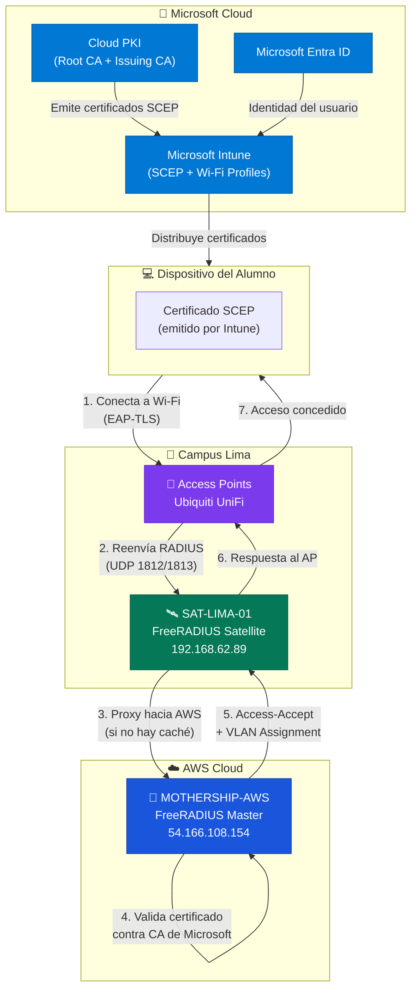

# Flujo de Autenticación: Mothership & Satellites

## Visión General

La arquitectura de autenticación de la **UPeU** sigue el modelo **Mothership-Satellite** recomendado por [InkBridge Networks](https://www.inkbridgenetworks.com/blog/blog-10/radius-for-universities-122). Este diseño centraliza la lógica de autenticación en la nube (AWS) y distribuye puntos de acceso locales en cada campus.

---

## Diagrama de Arquitectura

---

## Glosario de Componentes

| Componente | Rol | IP / Ubicación | Descripción |
|---|---|---|---|
| **MOTHERSHIP-AWS** | Servidor RADIUS Master | `54.166.108.154` (Elastic IP) | Cerebro central en AWS. Procesa autenticación EAP-TLS y valida certificados contra Microsoft Cloud PKI. |
| **SAT-LIMA-01** | Servidor RADIUS Satellite | `192.168.62.89` (Lima) | Proxy local que reenvía peticiones a AWS. Mantiene caché TLS para reconexiones rápidas. |
| **Access Points** | Puntos de acceso Wi-Fi | Red local `172.16.79.0/24` | Ubiquiti UniFi configurados para enviar peticiones RADIUS al Satellite local. |
| **Microsoft Entra ID** | Proveedor de Identidad | Cloud | Directorio de usuarios de la UPeU (correos institucionales). |
| **Microsoft Cloud PKI** | Infraestructura de Certificados | Cloud | Emite certificados raíz e intermedios para EAP-TLS. |
| **Microsoft Intune** | Gestión de Dispositivos (MDM) | Cloud | Distribuye certificados SCEP y perfiles Wi-Fi a los dispositivos de los alumnos. |

---

## Flujo Detallado de Autenticación

### Primera Conexión (Full EAP-TLS Handshake)
1. El dispositivo del alumno (con certificado SCEP instalado por Intune) se conecta al Wi-Fi empresarial.
2. El **Access Point** reenvía la solicitud RADIUS al **Satellite local** (puerto 1812).
3. El **Satellite** actúa como proxy y reenvía la solicitud a la **Mothership en AWS**.
4. La **Mothership** valida el certificado del dispositivo contra la CA de Microsoft Cloud PKI.
5. Si es válido, envía un `Access-Accept` con las políticas (VLAN, atributos) de vuelta al Satellite.
6. El Satellite entrega la respuesta al AP y el alumno navega.

### Reconexión Rápida (TLS Session Resumption)
1. Si el dispositivo se reconecta dentro del periodo de caché (24h), el **Satellite** encuentra el *Session Ticket* en su caché local.
2. **No se consulta a AWS** → el usuario entra instantáneamente.
3. En el log del Satellite se verá: `>>> CACHE HIT: Usuario autenticado desde memoria local`.

---

## Protocolos y Puertos

| Protocolo | Puerto | Uso |
|---|---|---|
| RADIUS Authentication | UDP 1812 | Autenticación EAP-TLS |
| RADIUS Accounting | UDP 1813 | Contabilidad de sesiones |
| SSH | TCP 22 | Administración de servidores |
| HTTPS | TCP 443 | Acceso a Intune y Entra ID |

---

## Stack Tecnológico

- **Identity Provider:** Microsoft Entra ID + Microsoft Cloud PKI
- **Endpoint Management:** Microsoft Intune (perfiles SCEP / Wi-Fi)
- **Policy Server:** FreeRADIUS 3.2.x en AWS EC2 (Ubuntu 24.04 LTS)
- **Satellites:** FreeRADIUS 3.2.x en Ubuntu (VMware local)
- **Cumplimiento:**
  - **Authentication:** EAP-TLS (Certificados digitales)
  - **Authorization:** Role-Based Access Control (RBAC) vía Entra Groups
  - **Accounting:** Interim-Update centralizado en AWS
