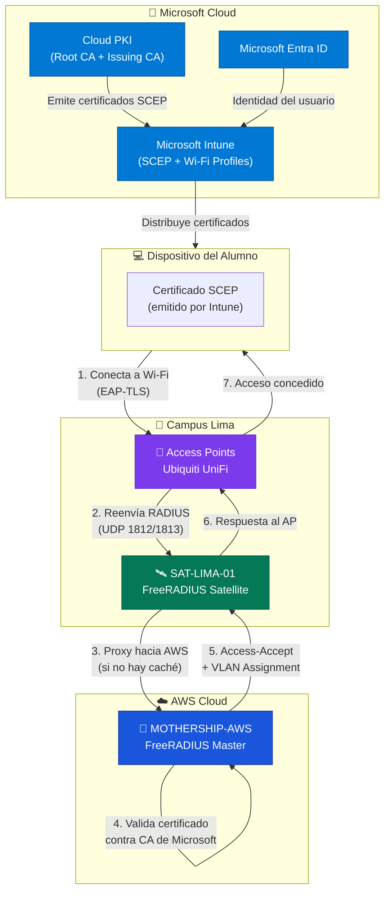

# Flujo de Autenticación: Mothership & Satellites

> **Rol:** Documento de referencia arquitectural — visión general del sistema
> **Referencia:** [InkBridge Networks — RADIUS for Universities](https://www.inkbridgenetworks.com/blog/blog-10/radius-for-universities-122)

---

## Visión General

La arquitectura de autenticación de la **UPeU** sigue el modelo **Mothership-Satellite** recomendado por [InkBridge Networks](https://www.inkbridgenetworks.com/blog/blog-10/radius-for-universities-122). Este diseño centraliza la lógica de autenticación en la nube (AWS) y distribuye puntos de acceso locales en cada campus.

---

## Diagrama de Arquitectura

---

## Glosario de Componentes

| Componente | Rol | IP / Ubicación | Descripción |
|---|---|---|---|
| **MOTHERSHIP-AWS** | Servidor RADIUS Master | `<IP_ELASTICA_MOTHERSHIP>` (Elastic IP) | Cerebro central en AWS. Procesa autenticación EAP-TLS, valida certificados contra Microsoft Cloud PKI y almacena Session Tickets (caché TLS). |
| **SAT-LIMA-01** | Servidor RADIUS Satellite | `<IP_SAT_LIMA_01>` (Lima) | Proxy puro que reenvía peticiones a AWS. Mantiene caché de atributos (VLAN, Reply-Message) para resiliencia ante caídas de la WAN. |
| **Access Points** | Puntos de acceso Wi-Fi | Red local `172.16.79.0/24` | Ubiquiti UniFi configurados para enviar peticiones RADIUS al Satellite local. |
| **Microsoft Entra ID** | Proveedor de Identidad | Cloud | Directorio de usuarios de la UPeU (correos institucionales). |
| **Microsoft Cloud PKI** | Infraestructura de Certificados | Cloud | Emite certificados raíz e intermedios para EAP-TLS. |
| **Microsoft Intune** | Gestión de Dispositivos (MDM) | Cloud | Distribuye certificados SCEP y perfiles Wi-Fi a los dispositivos de los alumnos. |

---

## Flujo Detallado de Autenticación

### Primera Conexión (Full EAP-TLS Handshake)
1. El dispositivo del alumno (con certificado SCEP instalado por Intune) se conecta al Wi-Fi empresarial.
2. El **Access Point** reenvía la solicitud RADIUS al **Satellite local** (puerto 1812).
3. El **Satellite** actúa como proxy y reenvía la solicitud a la **Mothership en AWS**.
4. La **Mothership** valida el certificado del dispositivo contra la CA de Microsoft Cloud PKI.
5. Si es válido, envía un `Access-Accept` con las políticas (VLAN, atributos) de vuelta al Satellite.
6. El Satellite entrega la respuesta al AP y el alumno navega.

### Reconexión Rápida (caché de atributos en el Satellite)
1. Si el dispositivo se reconecta dentro del periodo de caché (24h) y el **Satellite** tiene los atributos del usuario en su caché local (`rlm_cache`), responde directamente **sin consultar a AWS**.
2. El log del Satellite registrará: `>>> CACHE HIT: Usuario autenticado desde caché local en SAT-LIMA-01`.
3. Si el Satellite no tiene la entrada en caché (CACHE MISS), reenvía normalmente a la Mothership, que puede acelerar el handshake TLS usando el **Session Ticket** almacenado en su `tlscache`.

> [!NOTE]
> Los **Session Tickets** (TLS session resumption) residen en la Mothership (`/var/log/freeradius/tlscache`), no en el Satellite. El Satellite almacena únicamente atributos de respuesta (VLAN, Reply-Message) para continuar operando si la WAN cae. Ver [configuracion-proxy.md](../03-satellites-locales/configuracion-proxy.md#3-caché-mínima-de-atributos-resiliencia-de-red) y [configuracion-radius.md](../02-mothership-aws/configuracion-radius.md#4-preparación-del-almacén-de-caché-tls).

---

## Protocolos y Puertos

| Protocolo | Puerto | Uso |
|---|---|---|
| RADIUS Authentication | UDP 1812 | Autenticación EAP-TLS |
| RADIUS Accounting | UDP 1813 | Contabilidad de sesiones |
| SSH | TCP 22 | Administración de servidores |
| HTTPS | TCP 443 | Acceso a Intune y Entra ID |

---

## Stack Tecnológico

- **Identity Provider:** Microsoft Entra ID + Microsoft Cloud PKI
- **Endpoint Management:** Microsoft Intune (perfiles SCEP / Wi-Fi)
- **Policy Server:** FreeRADIUS 3.2.x en AWS EC2 (Ubuntu 24.04 LTS)
- **Satellites:** FreeRADIUS 3.2.x en Ubuntu (VMware local)
- **Cumplimiento:**
  - **Authentication:** EAP-TLS (Certificados digitales)
  - **Authorization:** Role-Based Access Control (RBAC) vía Entra Groups
  - **Accounting:** Interim-Update centralizado en AWS

---

## Siguientes Pasos

| Paso | Documento |
|---|---|
| 1. Desplegar la Mothership en AWS | [despliegue-instancia.md](../02-mothership-aws/despliegue-instancia.md) |
| 2. Configurar EAP-TLS y PKI en la Mothership | [configuracion-radius.md](../02-mothership-aws/configuracion-radius.md) |
| 3. Instalar el Satellite local | [instalacion-ubuntu.md](../03-satellites-locales/instalacion-ubuntu.md) |
| 4. Configurar el proxy en el Satellite | [configuracion-proxy.md](../03-satellites-locales/configuracion-proxy.md) |
| 5. Configurar Cloud PKI y certificados | [cloud-pki-config.md](../04-identidad-y-pki/cloud-pki-config.md) |
