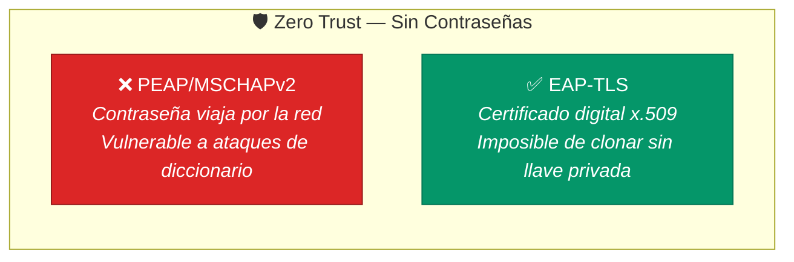
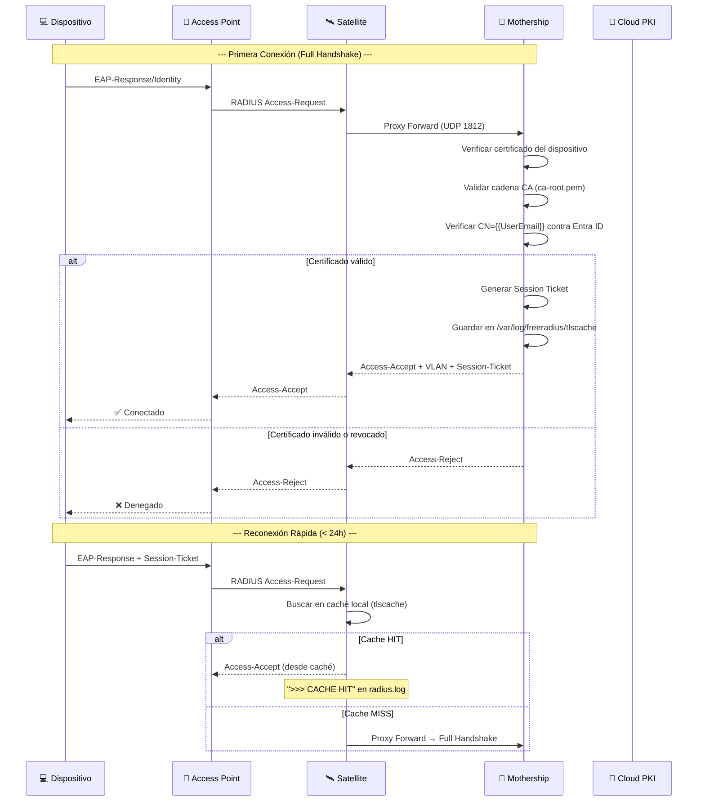
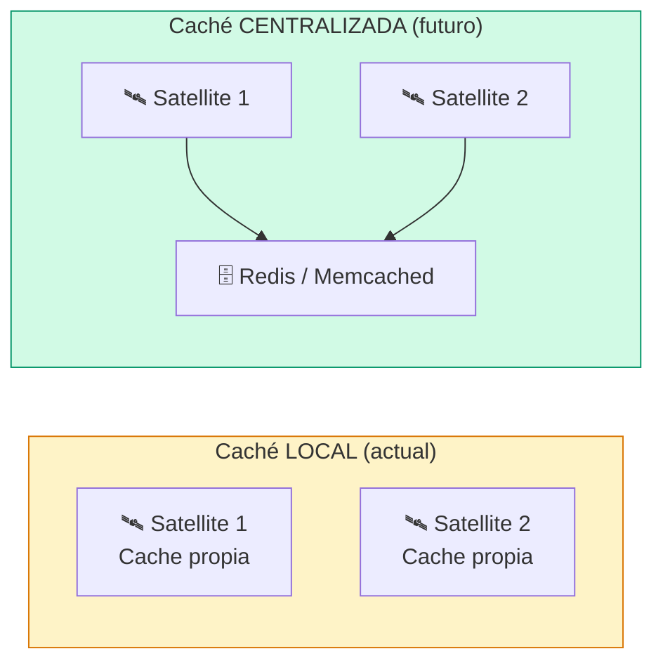

# Configuración RADIUS de la Mothership (AWS)

> **Rol:** Servidor RADIUS Master — Cerebro central de autenticación  
> **Referencia:** [InkBridge Networks — RADIUS for Universities](https://www.inkbridgenetworks.com/blog/blog-10/radius-for-universities-122)  
> **Versión:** FreeRADIUS 3.0.x sobre Ubuntu 24.04 LTS (AWS EC2)  

---

## Filosofía: ¿Por Qué EAP-TLS? (Zero Trust)

La UPeU implementa un modelo de **Cero Confianza** para su red Wi-Fi. Esto significa que **ningún dispositivo accede a la red por contraseña** — solo mediante un certificado digital emitido por Microsoft Cloud PKI y distribuido automáticamente por Intune.



**Decisión de diseño:** Al usar EAP-TLS exclusivamente, eliminamos los vectores de ataque más comunes en redes universitarias:
- **Evil Twin AP:** Inútil sin el certificado de la CA raíz de la UPeU.
- **Credential Stuffing:** No hay credenciales que robar.
- **Man-in-the-Middle:** El handshake TLS mutuo verifica ambos extremos.

---

## Diagrama: Flujo EAP-TLS Interno del Servidor



---

## 1. Registro de Satellites como Clientes RADIUS

Cada Satellite debe estar autorizado explícitamente en la Mothership.

📄 **Archivo:** `/etc/freeradius/3.0/clients.conf`

```bash
sudo nano /etc/freeradius/3.0/clients.conf
```

```ini
# ============================================================================
#  SATELLITE: Lima (SAT-LIMA-01)
#  Descripción: Proxy RADIUS en la sede de Lima. Reenvía peticiones EAP-TLS.
#  Ref: docs/03-satellites-locales/configuracion-proxy.md
# ============================================================================
client satellite-lima-01 {
    ipaddr   = <IP_PUBLICA_SATELLITE_LIMA>     # IP pública de la sede Lima
    secret   = <SHARED_SECRET_UPEU>            # Secreto compartido (mín. 16 caracteres)
    shortname = SAT-LIMA-01
    require_message_authenticator = yes        # Obligatorio — previene spoofing de paquetes
}

# ============================================================================
#  TEMPLATE: Agregar futuros Satellites aquí
# ============================================================================
# client satellite-juliaca-01 {
#     ipaddr   = <IP_PUBLICA_SATELLITE_JULIACA>
#     secret   = <SHARED_SECRET_UPEU>
#     shortname = SAT-JULIACA-01
#     require_message_authenticator = yes
# }
```

> [!IMPORTANT]
> **`require_message_authenticator = yes`** es obligatorio en toda arquitectura InkBridge. Sin este flag, un atacante podría inyectar paquetes RADIUS falsificados en la red.

---

## 2. Usuarios de Prueba (Solo Desarrollo)

📄 **Archivo:** `/etc/freeradius/3.0/users`

```bash
sudo nano /etc/freeradius/3.0/users
```

```ini
# ============================================================================
#  USUARIOS DE PRUEBA — Solo para validación inicial del túnel Satellite→Mothership
#  ⚠️  ELIMINAR en producción. La autenticación real es por certificado (EAP-TLS).
# ============================================================================
test1  Cleartext-Password := "<TEST_PASSWORD>"
test2  Cleartext-Password := "<TEST_PASSWORD>"
```

> [!CAUTION]
> Estos usuarios **no deben existir en producción**. En el modelo Zero Trust de la UPeU, toda autenticación se realiza mediante certificados x.509 emitidos por Microsoft Cloud PKI. Ver [04-identidad-y-pki/perfiles-intune.md](../04-identidad-y-pki/perfiles-intune.md).

---

## 3. Módulo EAP-TLS con Persistencia de Caché Integrada

Este es el componente central del servidor. Integra la autenticación por certificados, la caché TLS para Fast Reconnect y los Session Tickets para persistencia en disco.

📄 **Archivo:** `/etc/freeradius/3.0/mods-available/eap`

```bash
sudo nano /etc/freeradius/3.0/mods-available/eap
```

### 3.1 Tipo EAP por defecto

Cambiar la **línea 27** del archivo:

```ini
# Antes:  default_eap_type = md5
# Después: Forzar EAP-TLS exclusivamente (Zero Trust — sin contraseñas)
default_eap_type = tls
```

### 3.2 Bloque `tls-config tls-common` — Configuración Completa

Buscar la sección `tls-config tls-common { ... }` (aprox. línea 300) y reemplazar completamente:

```ini
tls-config tls-common {

    # ================================================================
    #  CERTIFICADOS — Rutas de la PKI de Microsoft Cloud (UPeU)
    #  Ref: docs/04-identidad-y-pki/cloud-pki-config.md
    # ================================================================

    # Llave privada del servidor RADIUS
    # (Generada al configurar el certificado del servidor)
    # private_key_password = <CERT_PASSWORD>   # Descomentar si la llave tiene passphrase
    private_key_file = ${certdir}/upeu/server-key.pem

    # Certificado público del servidor RADIUS
    certificate_file = ${certdir}/upeu/server-cert.pem

    # Certificado raíz de la CA de Microsoft Cloud PKI
    # ⚠️  Debe coincidir con la Root CA configurada en Intune
    ca_file = ${certdir}/upeu/ca-root.pem
    ca_path = ${cadir}

    # ================================================================
    #  RENDIMIENTO — Optimización para certificados de Microsoft
    #  InkBridge recomienda fragment_size ≥ 1024 para certificados
    #  pesados de Cloud PKI que incluyen extensiones SCEP
    # ================================================================

    # Parámetros Diffie-Hellman (pre-generados)
    dh_file = ${certdir}/dh

    # Fuente de entropía para operaciones criptográficas
    random_file = /dev/urandom

    # Fragmentación de certificados — Crítico para dispositivos móviles
    # Los certificados de Microsoft Cloud PKI son más grandes que los
    # de una CA on-premise. Sin este valor, muchos dispositivos
    # Android/iOS fallan en el handshake.
    fragment_size = 1024
    include_length = yes

    # ================================================================
    #  SEGURIDAD TLS — Protocolo y curvas criptográficas
    # ================================================================

    # TLS 1.2 es el mínimo seguro. Se puede subir a 1.3 cuando
    # todos los APs (Ubiquiti UniFi) soporten la versión.
    tls_min_version = "1.2"
    tls_max_version = "1.2"

    # Curva elíptica recomendada por Microsoft y compatibles con
    # Windows 11, macOS y dispositivos móviles modernos.
    # Dejarla vacía causa errores en clientes Windows 11.
    ecdh_curve = "prime256v1"

    # ================================================================
    #  CACHÉ TLS + FAST RECONNECT — Estándar InkBridge
    #
    #  Objetivo: "Baja Latencia" — después del primer handshake
    #  exitoso, las reconexiones dentro de 24h no viajan a AWS.
    #  El Session Ticket se almacena en disco (persist_dir) para
    #  sobrevivir reinicios del servicio.
    #
    #  Diagrama de decisión:
    #    Dispositivo se conecta → ¿Existe Session Ticket?
    #      SÍ → Access-Accept inmediato (sin EAP-TLS completo)
    #      NO → Full handshake → Validar cert → Generar ticket
    # ================================================================
    cache {
        # Habilitar caché de sesiones TLS
        enable = yes

        # Tiempo de vida de cada sesión en caché (horas)
        # 24h cubre una jornada académica completa
        lifetime = 24

        # Cantidad máxima de sesiones en memoria
        # Ajustar según población estudiantil activa
        # Para ~5,000 alumnos, 255 es conservador pero estable en t2.micro
        max_entries = 255

        # Nombre interno del almacén de caché
        # Obligatorio cuando se usa persist_dir
        name = "EAP_TLS_Cache"

        # Persistencia en disco — Las sesiones sobreviven un reinicio
        # del servicio FreeRADIUS (ej: durante actualizaciones del SO)
        persist_dir = "${logdir}/tlscache"
    }
}
```

### 3.3 Recuperación de Políticas (VLAN, atributos)

Para que las reconexiones rápidas (Fast Reconnect) conserven los atributos asignados (VLAN, bandwidth, etc.), habilitar en las secciones `peap` y `ttls`:

```ini
# Dentro del mismo archivo eap, sección peap {}
peap {
    # ... configuración existente ...
    use_tunneled_reply = yes    # Preservar VLAN y políticas en reconexión
}

# Sección ttls {}
ttls {
    # ... configuración existente ...
    use_tunneled_reply = yes    # Preservar VLAN y políticas en reconexión
}
```

### 3.4 Generar Parámetros Diffie-Hellman

El archivo DH es requerido por la directiva `dh_file`. Se genera una sola vez:

```bash
# Generar parámetros DH de 2048 bits (tarda 2-5 minutos)
sudo openssl dhparam -out /etc/freeradius/3.0/certs/dh 2048

# Asignar propiedad al usuario del servicio
sudo chown freerad:freerad /etc/freeradius/3.0/certs/dh
```

---

## 4. Preparación del Almacén de Caché TLS

La caché TLS necesita un directorio en disco con permisos restrictivos:

```bash
# Directorio principal de caché (sesiones TLS)
sudo mkdir -p /var/log/freeradius/tlscache
sudo chown freerad:freerad /var/log/freeradius/tlscache
sudo chmod 700 /var/log/freeradius/tlscache

# Directorio de Session Tickets (persistencia entre reinicios)
sudo mkdir -p /var/log/freeradius/tickets
sudo chown freerad:freerad /var/log/freeradius/tickets
sudo chmod 700 /var/log/freeradius/tickets
```

### Limpieza Automática (Cronjob)

Sin limpieza, la carpeta acumulará miles de archivos. Programar purga nocturna:

```bash
# Abrir editor de crontab
sudo crontab -e

# Agregar al final — limpia archivos con más de 2 días a las 03:00 AM
0 3 * * * find /var/log/freeradius/tlscache -type f -mtime +2 -delete
```

### Verificar que la Caché Funciona

Después de una autenticación exitosa:

```bash
# Contar sesiones almacenadas
sudo ls -1 /var/log/freeradius/tlscache | wc -l

# Ver detalles (archivos hexadecimales = Session Tickets)
sudo ls -la /var/log/freeradius/tlscache
```

> [!TIP]
> Si aparecen archivos hexadecimales, el Fast Reconnect está activo. Los dispositivos que ya se autenticaron **no necesitan un nuevo handshake** aunque reinicies la Mothership.

### Consideraciones Multi-Satellite (Roaming)



> [!IMPORTANT]
> En FreeRADIUS 3.x, la caché TLS es **local por servidor**. Si un alumno cambia de edificio (Satellite 1 → Satellite 2), se forzará un handshake completo. Para roaming real entre campus, implementar **Redis centralizado** como backend de caché compartida.

---

## 5. Optimización de Performance (Thread Pool)

📄 **Archivo:** `/etc/freeradius/3.0/radiusd.conf`

```bash
sudo nano /etc/freeradius/3.0/radiusd.conf
```

### Cálculo para UPeU

| Métrica | Valor | Justificación |
|---|---|---|
| Alumnos activos | ~5,000 | Matrícula estimada en todas las sedes |
| Conexiones simultáneas pico | ~800 | Inicio de clases (08:00 AM) |
| Reconexiones/hora | ~200 | Movimiento entre edificios |
| Threads recomendados | 150 | 800 ÷ 5.3 req/thread + margen 15% |

```ini
thread pool {
    # Hilos iniciales al arrancar (pre-carga para el inicio del día)
    start_servers = 10

    # Máximo de hilos concurrentes — dimensionado para picos de matrícula
    # InkBridge recomienda: (conexiones_pico / 5) + 20% de margen
    max_servers = 150

    # Mínimo de hilos en espera (listos para ráfagas imprevistas)
    min_spare_servers = 5

    # Máximo de hilos ociosos antes de que el servidor los recicle
    max_spare_servers = 20

    # Límite de peticiones por hilo antes de reciclar el thread
    # Previene fugas de memoria en jornadas largas de exámenes
    max_requests_per_server = 1000
}
```

---

## 6. Configuración de Logging (Política de Auditoría)

En el mismo archivo `radiusd.conf`, sección `log`:

```ini
log {
    destination = files
    colourise = yes
    file = ${logdir}/radius.log
    syslog_facility = daemon
    stripped_names = no

    # --- POLÍTICA DE AUDITORÍA (Zero Trust) ---

    # Registrar TODOS los intentos de autenticación (exitosos y fallidos)
    # Obligatorio en la Mothership para auditoría centralizada
    auth = yes

    # Registrar contraseñas erróneas para detectar ataques de fuerza bruta
    # ⚠️  Solo habilitar en la Mothership, nunca en Satellites
    auth_badpass = yes

    # NO registrar contraseñas correctas (principio de mínimo privilegio)
    auth_goodpass = no
}
```

> [!WARNING]
> **Política de Auditoría InkBridge:**
> - **Mothership:** `auth = yes` + `auth_badpass = yes` (registro completo para cumplimiento)
> - **Satellites:** `auth = no` (no duplicar registros; la Mothership ya centraliza la auditoría)

---

## 7. Validación y Activación

### Pre-vuelo (obligatorio antes de reiniciar)

```bash
# Verificar que no hay errores de sintaxis en toda la configuración
sudo freeradius -CX
```

Si la salida termina con `Configuration appears to be OK`, proceder:

```bash
# Reiniciar el servicio
sudo systemctl restart freeradius

# Verificar estado
sudo systemctl status freeradius

# Habilitar inicio automático
sudo systemctl enable freeradius
```

### Test de Autenticación (desde un Satellite)

```bash
# Desde la terminal del Satellite, usando un usuario de prueba
radtest test1 <TEST_PASSWORD> <IP_MOTHERSHIP> 0 <SHARED_SECRET_UPEU>
```

**Resultado esperado:** `Access-Accept` con atributos de sesión.

---

## Archivos Modificados — Resumen

| Archivo | Cambio Principal |
|---|---|
| `/etc/freeradius/3.0/clients.conf` | Registro de Satellites con `require_message_authenticator` |
| `/etc/freeradius/3.0/users` | Usuarios de prueba (eliminar en producción) |
| `/etc/freeradius/3.0/mods-available/eap` | EAP-TLS + caché integrada + Session Tickets |
| `/etc/freeradius/3.0/radiusd.conf` | Thread pool + logging de auditoría |
| `/var/log/freeradius/tlscache/` | Directorio de persistencia de caché |
| `/var/log/freeradius/tickets/` | Directorio de Session Tickets |
| `crontab (root)` | Limpieza nocturna de caché |
