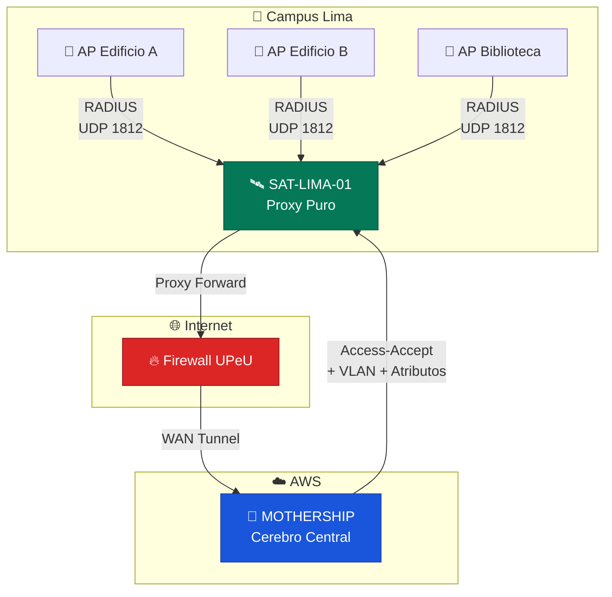
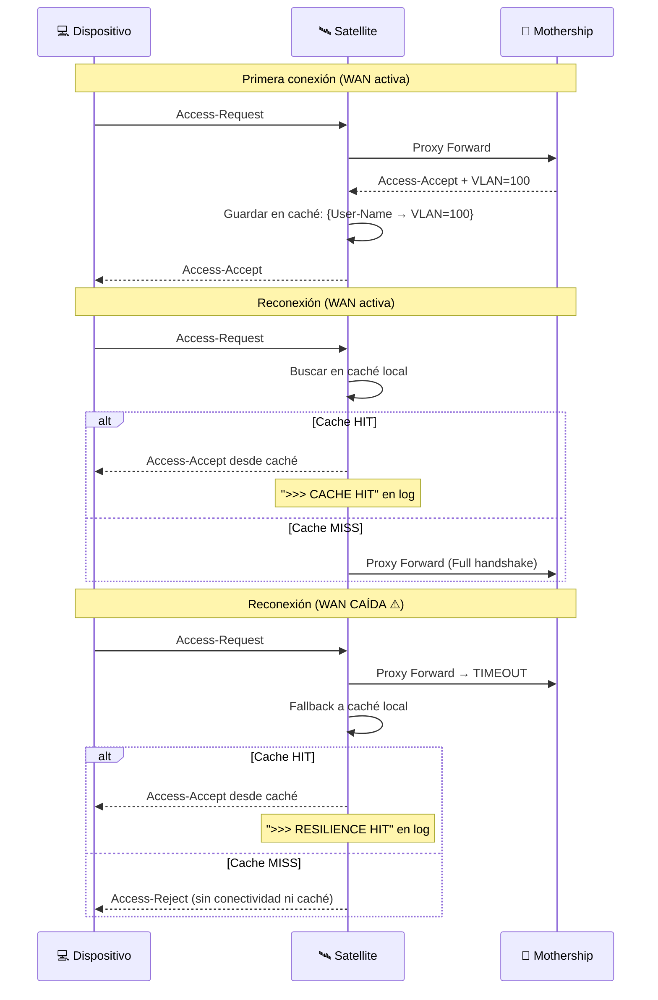
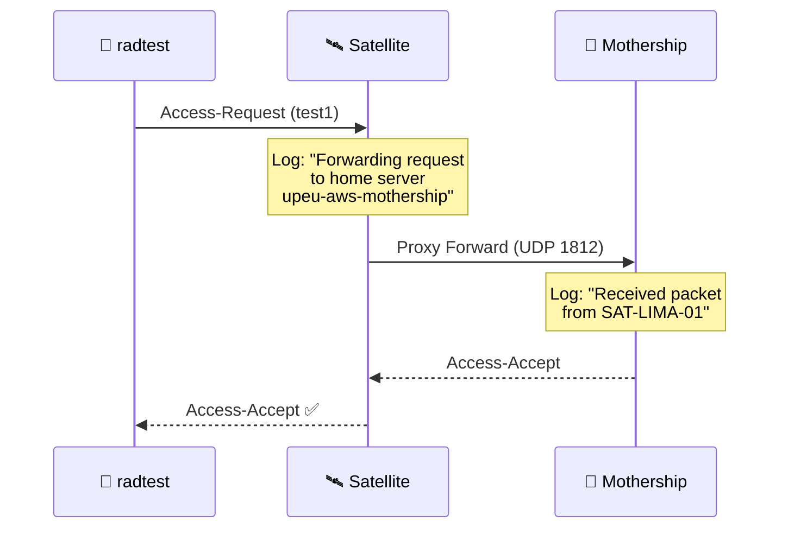

# 2. Configuración Unificada del Satellite (Proxy Puro)

> **Rol:** Satellite — Proxy puro con caché mínima de atributos para resiliencia
> **Referencia:** [InkBridge Networks — RADIUS for Universities](https://www.inkbridgenetworks.com/blog/blog-10/radius-for-universities-122)
> **Versión:** FreeRADIUS 3.2.x sobre Ubuntu 24.04 LTS (VMware local)

---

## Principio de Diseño: Proxy Puro

El Satellite de la UPeU sigue el modelo **"Proxy Puro"** de InkBridge. Esto significa:

| Responsabilidad | ¿Satellite? | ¿Mothership? |
|---|---|---|
| Recibir peticiones de los APs | ✅ | ❌ |
| Reenviar peticiones RADIUS (proxy) | ✅ | ❌ |
| Validar certificados EAP-TLS | ❌ | ✅ |
| Decidir Access-Accept/Reject | ❌ | ✅ |
| Caché de atributos (VLAN, Reply-Message) | ✅ Mínima | ✅ Completa |
| Registrar auditoría completa | ❌ | ✅ |



> [!TIP]
> **¿Por qué proxy puro?** Si la Mothership cae, el Satellite puede seguir sirviendo reconexiones desde su caché local de atributos. Pero la decisión de autenticación *siempre* es de la Mothership. Esto simplifica la auditoría y elimina la necesidad de sincronizar certificados entre sedes.

---

## 1. Definir la Mothership como Home Server

📄 **Archivo:** `/etc/freeradius/3.0/proxy.conf`

```bash
sudo nano /etc/freeradius/3.0/proxy.conf
```

```ini
# ============================================================================
#  CONFIGURACIÓN GLOBAL DEL PROXY
# ============================================================================
proxy server {
    # No usar servidores de respaldo automáticamente cuando el home server
    # principal falla. Con fail-over explícito en el pool, default_fallback
    # causaría comportamiento impredecible en redes de un solo Mothership.
    default_fallback = no
}

# ============================================================================
#  MOTHERSHIP — Servidor Master de AWS
#  Todas las peticiones de autenticación se reenvían aquí.
#  El Satellite NO toma decisiones de acceso por sí mismo.
#  Ref: docs/02-mothership-aws/configuracion-radius.md
# ============================================================================
home_server upeu-aws-mothership {
    # Tipo: autenticación + contabilidad (reenviar todo)
    type     = auth+acct

    # Elastic IP de la Mothership en AWS
    ipaddr   = <IP_ELASTICA_MOTHERSHIP>

    # Puerto RADIUS estándar
    port     = 1812

    # Secreto compartido — DEBE coincidir con clients.conf de la Mothership
    secret   = <SHARED_SECRET_UPEU>

    # --- HEALTH CHECK (Resiliencia InkBridge) ---
    # Si la Mothership no responde en 5 segundos, marcarla como caída
    response_window = 5

    # Período zombie: tiempo de espera antes de reintentar tras un fallo.
    # 40s (subido de 30s) reduce la presión sobre WAN en condiciones inestables
    zombie_period = 40

    # Número de paquetes de prueba para declarar "revivida"
    revive_interval = 60

    # Verificación activa de estado — envía paquetes Status-Server periódicamente
    # para detectar caídas de la Mothership antes de que llegue tráfico real
    status_check = status-server

    # Timeouts de red — ajustados para latencia WAN Lima→AWS
    response_timeouts = 3
}

# ============================================================================
#  POOL DE SERVIDORES — Fail-over para resiliencia
#  En el futuro se pueden agregar Motherships de respaldo aquí.
# ============================================================================
home_server_pool upeu-pool-cloud-auth {
    type = fail-over
    home_server = upeu-aws-mothership

    # FUTURO: Agregar Mothership de respaldo
    # home_server = upeu-aws-mothership-backup
}

# ============================================================================
#  REALMS — Direccionamiento de peticiones al pool
#  Todas las peticiones (con o sin dominio) van a la Mothership.
# ============================================================================

# Usuarios con dominio explícito @upeu.edu.pe
realm upeu.edu.pe {
    auth_pool = upeu-pool-cloud-auth
    acct_pool = upeu-pool-cloud-auth
}

# Realm por defecto — dispositivos que no envían dominio
# (Ej: certificados EAP-TLS con CN=email sin realm)
realm LOCAL {
    auth_pool = upeu-pool-cloud-auth
    acct_pool = upeu-pool-cloud-auth
}

# Realm NULL — peticiones sin User-Name o con formato inesperado
realm NULL {
    auth_pool = upeu-pool-cloud-auth
    acct_pool = upeu-pool-cloud-auth
}
```

> [!IMPORTANT]
> **Health Check:** Los parámetros `response_window`, `zombie_period` y `revive_interval` son esenciales en el modelo InkBridge. Sin ellos, si la Mothership cae, el Satellite seguirá enviando peticiones al vacío hasta que el timeout del AP expire y el usuario vea un error de conexión.

---

## 2. Registrar Access Points Locales

📄 **Archivo:** `/etc/freeradius/3.0/clients.conf`

```bash
sudo nano /etc/freeradius/3.0/clients.conf
```

```ini
# ============================================================================
#  ACCESS POINTS — Campus Lima
#  Cada AP o rango de APs que envía peticiones RADIUS al Satellite.
#  Este secreto se configura en el controlador UniFi / Cisco WLC.
# ============================================================================

# Rango completo del campus Lima (todos los APs en la VLAN de gestión)
client campus-lima-aps {
    ipaddr    = <SUBRED_APS_LIMA>              # Ej: 172.16.79.0/24
    secret    = <SHARED_SECRET_AP_LIMA>        # Secreto AP ↔ Satellite
    shortname = CAMPUS-LIMA-APS
    require_message_authenticator = yes        # Mitigación CVE-2024-3596 (BLASTRADIUS)
    limit_proxy_state = yes                    # Previene abuso del atributo Proxy-State
}

# ============================================================================
#  TEMPLATE: Agregar APs específicos si se necesita granularidad
# ============================================================================
# client ap-biblioteca-lima {
#     ipaddr    = 172.16.79.10
#     secret    = <SHARED_SECRET_AP_LIMA>
#     shortname = AP-BIBLIO-LIMA
#     require_message_authenticator = yes
#     limit_proxy_state = yes
# }
```

> [!WARNING]
> **Separación de secretos (buena práctica InkBridge):**
> - `<SHARED_SECRET_UPEU>` → Secreto entre Satellite ↔ Mothership (proxy.conf y clients.conf en AWS)
> - `<SHARED_SECRET_AP_LIMA>` → Secreto entre Access Points ↔ Satellite (clients.conf local y configuración del controlador Wi-Fi)
>
> Usar **secretos diferentes** reduce el impacto si uno de los dos se compromete.

> [!IMPORTANT]
> **Mitigación BLASTRADIUS (CVE-2024-3596):** `require_message_authenticator = yes` y `limit_proxy_state = yes` son obligatorios en **todos** los clientes RADIUS. Para detalles técnicos de esta vulnerabilidad, ver [configuracion-radius.md — §1 Registro de Satellites](../02-mothership-aws/configuracion-radius.md#1-registro-de-satellites-como-clientes-radius).

---

## 3. Caché Mínima de Atributos (Resiliencia de Red)

El Satellite mantiene una caché local **exclusivamente de atributos** (no de sesiones TLS completas). Esto permite que, si la WAN hacia AWS se interrumpe brevemente, los usuarios que ya se autenticaron puedan reconectarse con sus atributos en caché.



### 3.1 Habilitar Módulo de Caché

📄 **Archivo:** `/etc/freeradius/3.0/mods-available/cache`

Crear o editar el archivo de caché:

```bash
sudo nano /etc/freeradius/3.0/mods-available/cache
```

```ini
# ============================================================================
#  CACHÉ DE ATRIBUTOS — Solo para resiliencia de red
#  NO es caché de sesiones TLS (eso lo maneja la Mothership).
#  Almacena: User-Name → Atributos de respuesta (VLAN, Reply-Message)
# ============================================================================
cache {
    # Backend de almacenamiento en memoria (árbol rojo-negro)
    # Requerido en FreeRADIUS 3.2.x — reemplaza el obsoleto "module = "rlm_cache""
    driver = "rlm_cache_rbtree"

    # Clave de búsqueda: por usuario
    key = "%{User-Name}"

    # Tiempo de vida: 24 horas (una jornada académica)
    ttl = 86400

    # Máximo de entradas — ajustar según alumnos activos por sede
    # Aumentado a 2000 para cubrir jornadas completas en campus Lima
    max_entries = 2000

    # Atributos a cachear (solo los necesarios para reconexión)
    update reply {
        &Reply-Message := &reply:Reply-Message
        &Tunnel-Type := &reply:Tunnel-Type
        &Tunnel-Medium-Type := &reply:Tunnel-Medium-Type
        &Tunnel-Private-Group-ID := &reply:Tunnel-Private-Group-ID
    }
}
```

### 3.2 Activar el Enlace Simbólico

```bash
# Habilitar el módulo de caché
sudo ln -sf /etc/freeradius/3.0/mods-available/cache /etc/freeradius/3.0/mods-enabled/cache
```

### 3.3 Integrar en el Virtual Server

📄 **Archivo:** `/etc/freeradius/3.0/sites-enabled/default`

```bash
sudo nano /etc/freeradius/3.0/sites-enabled/default
```

Busca la sección `authorize { ... }` y agrega el bloque de caché:

```ini
authorize {
    # ... directivas existentes (preprocess, suffix, files, etc.) ...

    # ================================================================
    #  CACHÉ DE ATRIBUTOS — Resiliencia InkBridge
    #  Verifica si el usuario tiene atributos en caché local.
    #  Si los tiene, responde inmediatamente sin consultar a AWS.
    # ================================================================
    cache
    if (ok) {
        # Registrar en log para monitoreo operativo
        update reply {
            &Reply-Message += ">>> CACHE HIT: Usuario %{User-Name} autenticado desde caché local en SAT-LIMA-01"
        }
        update control {
            Auth-Type := Accept
        }
    }
}
```

En la sección `post-auth { ... }`, agregar el almacenamiento de atributos **después** de una autenticación exitosa:

```ini
post-auth {
    # ... directivas existentes ...

    # ================================================================
    #  Guardar atributos en caché después de autenticación exitosa
    #  Solo se ejecuta cuando la Mothership respondió Access-Accept
    # ================================================================
    cache
}
```

---

## 4. Configuración de Logging del Satellite

📄 **Archivo:** `/etc/freeradius/3.0/radiusd.conf`

```bash
sudo nano /etc/freeradius/3.0/radiusd.conf
```

```ini
log {
    destination = files
    colourise = yes
    file = ${logdir}/radius.log
    syslog_facility = daemon
    stripped_names = no

    # --- POLÍTICA SATELLITE (InkBridge) ---
    # El Satellite NO registra auditoría completa (lo hace la Mothership).
    # Solo registra eventos de caché y errores de conectividad.
    auth = no               # La Mothership centraliza la auditoría
    auth_badpass = no        # No duplicar en el Satellite
    auth_goodpass = no       # No duplicar en el Satellite
}
```

> [!NOTE]
> **¿Por qué `auth = no`?** En el modelo InkBridge, **la Mothership es la única fuente de verdad** para auditoría. Si ambos servidores registran, se generan logs duplicados que complican la correlación de eventos. Los `CACHE HIT` del Satellite se registran a través de `Reply-Message`, que es suficiente para monitoreo operativo.

---

## 5. Pruebas de Conectividad

### 5.1 Validar Configuración

```bash
# Verificar que no hay errores de sintaxis
sudo freeradius -CX
```

Si termina con `Configuration appears to be OK`, continuar.

### 5.2 Test en Modo Debug

```bash
# Limpiar procesos residuales
sudo systemctl stop freeradius
sudo pkill -9 freeradius 2>/dev/null

# Verificar puertos libres
sudo ss -lupn | grep -E '1812|1813'

# Lanzar en modo debug
sudo freeradius -X
```

### 5.3 Prueba de Túnel Satellite → Mothership

En **otra terminal** del Satellite:

```bash
# Enviar petición de prueba a través del proxy
radtest test1 <TEST_PASSWORD> 127.0.0.1 0 <SHARED_SECRET_UPEU>
```

> [!NOTE]
> **¿Por qué `127.0.0.1`?** FreeRADIUS incluye un `client localhost` predeterminado que acepta peticiones desde `127.0.0.1` con el secreto `testing123`. Sin embargo, al usar `radtest` con el secreto del proxy (`<SHARED_SECRET_UPEU>`), se verifica que la petición traverse correctamente el stack de proxy hacia la Mothership. Si no funciona con este secreto, probar con `testing123` para aislar si el problema es local o de red.

### Resultados Esperados



| Terminal | Log esperado |
|---|---|
| **Satellite** (debug) | `Forwarding request to home server upeu-aws-mothership` |
| **Mothership** (debug) | Ráfaga de texto terminando en `Sending Access-Accept` |
| **radtest** (resultado) | `Access-Accept` con atributos del usuario |

---

## 6. Activación como Servicio de Producción

Una vez validadas las pruebas:

```bash
# Salir del modo debug (Ctrl+C)

# Verificar permisos (el debug corre como root y puede cambiar permisos)
sudo chown -R freerad:freerad /etc/freeradius/3.0/

# Activar servicio
sudo systemctl start freeradius

# Habilitar arranque automático
sudo systemctl enable freeradius

# Confirmar estado
sudo systemctl status freeradius
```

> [!CAUTION]
> **Post-activación:** Verifica que al menos un dispositivo se conecta al Wi-Fi correctamente. Si falla, el problema más común es de **permisos** — el modo debug (`-X`) corre como `root` y crea archivos que el usuario `freerad` del servicio no puede leer.

---

## Archivos Modificados — Resumen

| Archivo | Cambio |
|---|---|
| `/etc/freeradius/3.0/proxy.conf` | Home server + pool + realms + health check |
| `/etc/freeradius/3.0/clients.conf` | Registro de Access Points del campus |
| `/etc/freeradius/3.0/mods-available/cache` | Caché mínima de atributos |
| `/etc/freeradius/3.0/mods-enabled/cache` | Enlace simbólico (activación) |
| `/etc/freeradius/3.0/sites-enabled/default` | Integración caché en authorize + post-auth |
| `/etc/freeradius/3.0/radiusd.conf` | Logging sin auditoría (delegada a Mothership) |

---

→ **Siguiente paso:** [Monitoreo y Logs](../05-operaciones/monitoreo-logs.md) — verificar que el Satellite proxy y la caché funcionan correctamente en producción.
