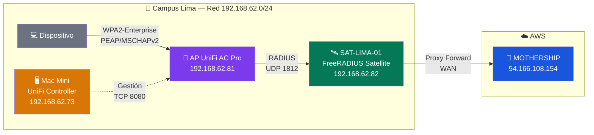
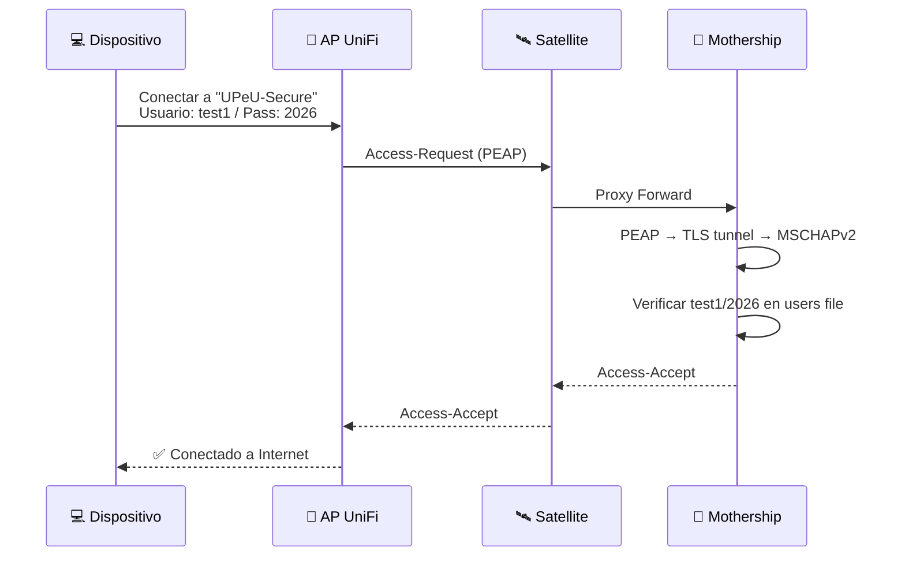

# 3. Configuración del AP y UniFi Controller

> **Rol:** Access Points UniFi — Puerta de entrada a la red Wi-Fi empresarial  
> **Controlador:** UniFi Network Application (Mac Mini o UniFi OS Console)  
> **Modelo validado:** UAP-AC-Pro-Gen2 (firmware 6.8.2)

---

## Arquitectura de Red Local



---

## 1. Adopción del AP

### 1.1 Requisitos previos

- UniFi Network Application corriendo (accesible en `https://192.168.62.73:8443`)
- AP y Mac Mini en la misma subred (`192.168.62.0/24`)
- AP con acceso a Internet (para firmware updates)

### 1.2 Configurar Inform Host

En **UniFi Network → Settings → System → Advanced**:

| Campo | Valor |
|---|---|
| Inform Host Override | ✅ Habilitado |
| Inform Host | `192.168.62.73` (IP del Mac Mini) |

### 1.3 Adoptar el AP

Si el AP no aparece automáticamente en la lista de dispositivos:

```bash
# SSH al AP (credenciales por defecto: ubnt/ubnt)
ssh ubnt@192.168.62.81

# Apuntar al controlador
set-inform http://192.168.62.73:8080/inform
```

Si el AP estaba asociado a otro controlador, primero resetearlo:

```bash
# Desde SSH al AP — factory reset
syswrapper.sh restore-default

# Esperar 2-3 minutos, luego reconectar:
ssh ubnt@192.168.62.81
set-inform http://192.168.62.73:8080/inform
```

En el controlador UniFi, el AP aparecerá como **"Pending Adoption"** → clic en **Adopt**.

> [!TIP]
> Si después de adoptar aparece como "Disconnected", ejecutar `set-inform` otra vez desde el AP.

---

## 2. Crear el Perfil RADIUS

En **UniFi Network → Settings → Profiles → RADIUS → Create New**:

| Campo | Valor |
|---|---|
| **Profile Name** | `RADIUS-UPeU` |
| **Authentication Server** | |
| IP Address | `192.168.62.82` |
| Port | `1812` |
| Shared Secret | `<SHARED_SECRET_AP_LIMA>` |
| **Accounting Server** | ✅ Habilitado |
| IP Address | `192.168.62.82` |
| Port | `1813` |
| Shared Secret | `<SHARED_SECRET_AP_LIMA>` |

Clic en **Save**.

> [!IMPORTANT]
> El `<SHARED_SECRET_AP_LIMA>` debe coincidir **exactamente** con el secreto configurado en el `clients.conf` del Satellite. Es el secreto AP ↔ Satellite, **no** el secreto Satellite ↔ Mothership.

---

## 3. Crear la Red WiFi (WPA2-Enterprise)

En **UniFi Network → Settings → WiFi → Create New**:

| Campo | Valor |
|---|---|
| **Network Name (SSID)** | `UPeU-Secure` |
| **Security Protocol** | WPA2-Enterprise |
| **RADIUS Profile** | `RADIUS-UPeU` |
| **VLAN** | (dejar vacío — el RADIUS asigna la VLAN) |
| **Band** | Both (2.4 GHz + 5 GHz) |

Clic en **Save**. El controlador provisionará automáticamente el AP con esta configuración.

> [!WARNING]
> No marcar "Guest Network" — esto es para autenticación corporativa con 802.1X.

---

## 4. Verificación

### 4.1 Verificar que el AP tiene la configuración

En **UniFi Network → Devices → AC Pro**:
- Estado: **Connected** ✅
- SSID `UPeU-Secure` visible en la lista de redes

### 4.2 Probar conexión desde un dispositivo

1. Desde un teléfono o laptop, buscar la red **`UPeU-Secure`**
2. Seleccionar WPA2-Enterprise / 802.1X
3. Ingresar:
   - **Método EAP:** PEAP
   - **Autenticación interna:** MSCHAPv2
   - **Usuario:** `test1`
   - **Contraseña:** `2026`
4. Si pregunta sobre el certificado del servidor → **Aceptar/Confiar**

> [!NOTE]
> El aviso sobre el certificado aparece porque estamos usando certificados autofirmados (Opción B). Con certificados de Azure Cloud PKI (Opción A), los dispositivos gestionados por Intune confiarán automáticamente.

### 4.3 Verificar en los logs del Satellite

```bash
sudo tail -f /var/log/freeradius/radius.log
```

Debería mostrar la petición proxied del AP al Satellite y la respuesta de la Mothership.

### 4.4 Verificar en los logs de la Mothership

```bash
sudo tail -f /var/log/freeradius/radius.log
```

Debería mostrar:
```
Auth: Login OK: [test1] (from client SAT-LIMA-01 port 0 cli <MAC_DISPOSITIVO>)
```

---

## 5. Flujo completo verificado



---

## Tabla de IPs y Secretos

| Componente | IP | Secreto asociado |
|---|---|---|
| Mac Mini (UniFi Controller) | `192.168.62.73` | — (solo gestión) |
| AP UniFi AC Pro | `192.168.62.81` | `<SHARED_SECRET_AP_LIMA>` → Satellite |
| Satellite (SAT-LIMA-01) | `192.168.62.82` | `<SHARED_SECRET_UPEU>` → Mothership |
| Mothership (AWS) | `54.166.108.154` | acepta desde `<IP_PUBLICA_SAT_LIMA_01>` |

> [!IMPORTANT]
> **Dos secretos diferentes (buena práctica InkBridge):**
> - `<SHARED_SECRET_AP_LIMA>` → entre APs y Satellite (tráfico local)
> - `<SHARED_SECRET_UPEU>` → entre Satellite y Mothership (tráfico WAN)

---

→ **Siguiente paso:** [Monitoreo y Logs](../05-operaciones/monitoreo-logs.md) — verificar que toda la cadena funciona correctamente en producción.
