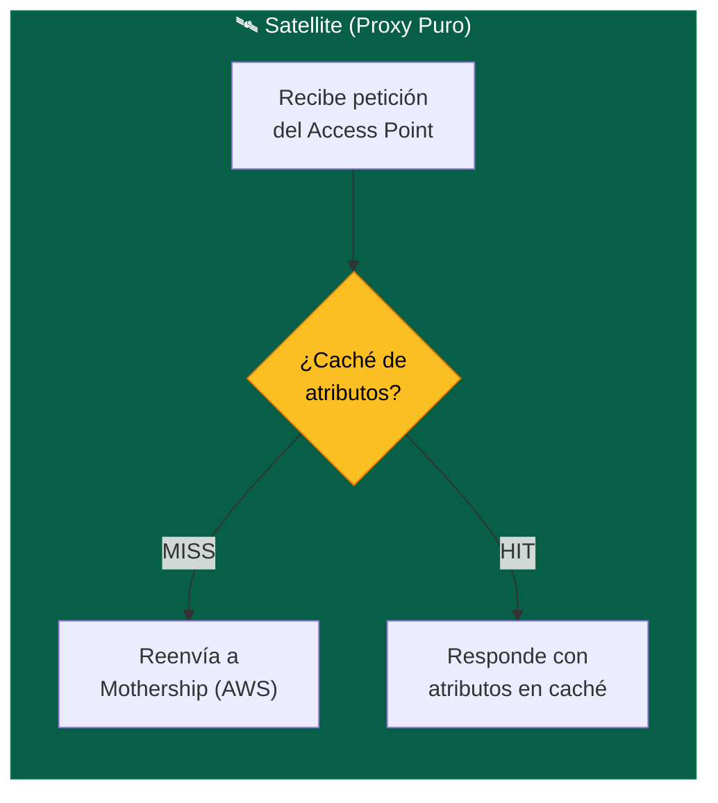

# Instalación del Satellite en Ubuntu

> **Rol:** Servidor RADIUS Satellite — Proxy puro con caché mínima de atributos  
> **Referencia:** [InkBridge Networks — RADIUS for Universities](https://www.inkbridgenetworks.com/blog/blog-10/radius-for-universities-122)  
> **Versión:** FreeRADIUS 3.2.x sobre Ubuntu Server (VMware local)

---

## Filosofía del Satellite (InkBridge)

El Satellite **no toma decisiones de autenticación**. Su única función es reducir la latencia percibida por los dispositivos y servir como punto de resiliencia local ante caídas de la WAN.



> [!IMPORTANT]
> **Principio InkBridge "Baja Latencia":** El Satellite mantiene una caché *mínima* de atributos (VLAN, Reply-Message) para reconexiones rápidas. **No almacena certificados ni realiza validación criptográfica** — eso es responsabilidad exclusiva de la Mothership.

---

## Prerrequisitos

| Parámetro | Valor | Notas |
|---|---|---|
| **Hostname** | `sat-lima-01` | Nombre estándar InkBridge: `sat-<sede>-<número>` |
| **IP Local** | `192.168.62.89` | IP fija en la red del campus |
| **IP Pública** | `<IP_PUBLICA_SATELLITE_LIMA>` | IP que ve la Mothership en AWS |
| **SO** | Ubuntu Server 24.04 LTS | Misma versión que la Mothership para consistencia |
| **Rol** | Proxy RADIUS (Satellite) | No procesa EAP-TLS localmente |
| **Virtualización** | VMware (vmware01) | Puede ser bare-metal o contenedor |

---

## 1. Instalación de FreeRADIUS

```bash
# Actualizar sistema base
sudo apt update && sudo apt upgrade -y

# Instalar FreeRADIUS y herramientas de diagnóstico
sudo apt install freeradius freeradius-utils -y
```

### Verificar instalación

```bash
# Confirmar versión (debe ser 3.2.x)
sudo freeradius -v

# Verificar que el servicio arrancó
systemctl status freeradius
```

---

## 2. Detener el Servicio para Configuración

Como el Satellite será un **proxy puro**, debemos detener el servicio predeterminado y configurar los archivos antes de activarlo en producción:

```bash
# Detener servicio automático
sudo systemctl stop freeradius

# Deshabilitar arranque automático (hasta que la configuración esté lista)
sudo systemctl disable freeradius
```

> [!NOTE]
> Deshabilitamos el arranque automático intencionalmente. Lo reactivaremos al final de la [configuración del proxy](configuracion-proxy.md) una vez que todo esté validado.

---

## 3. Modo Debug (Diagnóstico)

Antes de configurar el proxy, verifica que la instalación base funciona:

```bash
# Asegurar que no hay procesos residuales
sudo systemctl stop freeradius
sudo pkill -9 freeradius 2>/dev/null

# Verificar que los puertos RADIUS están libres
sudo ss -lupn | grep -E '1812|1813'
# Si no devuelve nada → puertos disponibles

# Lanzar en modo debug (verbose)
sudo freeradius -X
```

**Resultado esperado:** El servidor arranca y muestra `Ready to process requests` al final. Presiona `Ctrl+C` para salir.

---

## Siguiente Paso

→ **[Configuración Unificada del Proxy](configuracion-proxy.md):** Configurar el reenvío hacia la Mothership, registrar los Access Points y habilitar la caché de atributos para resiliencia.
