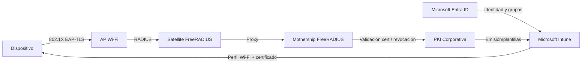

# PKI en la Arquitectura Madre Mothership-Satellite

> **Propósito:** definir el rol de la PKI dentro de la arquitectura Wi-Fi empresarial de UPeU sin replicar implementación operativa de PKI en este repositorio.

---

## 1) Rol de la PKI dentro de Mothership-Satellite

En el modelo **Mothership-Satellite**, la PKI cumple una función de **confianza criptográfica institucional**:

- Emite certificados para autenticación 802.1X (dispositivo y/o usuario).
- Publica el estado de validez (vigencia y revocación) de certificados.
- Proporciona la cadena de confianza que consume FreeRADIUS para EAP-TLS.
- Habilita provisión automatizada vía Intune (SCEP/perfiles Wi-Fi).

La **Mothership FreeRADIUS** no reemplaza a la PKI; la consume como servicio de confianza para decidir `Access-Accept` o `Access-Reject`.

---

## 2) Flujo EAP-TLS (alto nivel)

1. El dispositivo administrado recibe perfil Wi-Fi + certificado desde Intune.
2. El usuario/dispositivo inicia conexión 802.1X con EAP-TLS en el AP.
3. El AP envía solicitud RADIUS al Satellite local.
4. El Satellite proxifica hacia Mothership.
5. Mothership valida cadena y estado del certificado contra la PKI corporativa.
6. Si la validación es correcta, se aplican políticas de autorización (RBAC/VLAN) y se retorna `Access-Accept`.
7. Si no, se retorna `Access-Reject` con trazabilidad en logs RADIUS.

---

## 3) Relación FreeRADIUS ↔ PKI ↔ Intune/Entra

### Dependencias funcionales

- **FreeRADIUS**: motor AAA y políticas de red.
- **PKI**: emisión, revocación y jerarquía de certificados.
- **Intune/Entra**: identidad, enrolamiento y distribución de perfiles/certificados.

---

## 4) Repositorios externos de referencia PKI

La PKI se gobierna en repositorios separados:

- [`upeu-pki-architecture`](https://github.com/UPeU-CRAI/upeu-pki-architecture): arquitectura de confianza, políticas, roles y ciclo de vida.
- [`upeu-ejbca-pki`](https://github.com/UPeU-CRAI/upeu-ejbca-pki): implementación operativa de EJBCA, hardening y operación técnica de la CA.

Este repositorio (`upeu-mothership-radius`) **solo referencia** esos componentes para integración.

---

## 5) Decisiones arquitectónicas

1. **Separación de dominios de responsabilidad:** RADIUS y PKI tienen ciclos de cambio y riesgos diferentes.
2. **Reducción de superficie de riesgo:** evitar coexistencia de secretos PKI y operación AAA en un mismo repositorio.
3. **Trazabilidad y auditoría:** cambios PKI auditables en repos dedicados.
4. **Escalabilidad institucional:** reutilización de PKI para otros servicios sin acoplarse a FreeRADIUS.

Para el detalle formal, ver ADR: `docs/08-adr/0001-pki-repos-separados.md`.

---

## 6) Límites del repositorio

### Sí debe incluir

- Arquitectura y operación de Mothership-Satellite.
- Integración de FreeRADIUS con servicios de identidad y confianza.
- Guías de despliegue de RADIUS (mothership y satellites).

### No debe incluir

- Scripts de despliegue interno de PKI (CA/RA/OCSP).
- Llaves privadas, backups criptográficos, secretos o material sensible de CA.
- Configuración interna detallada de EJBCA o runbooks de operación PKI.

