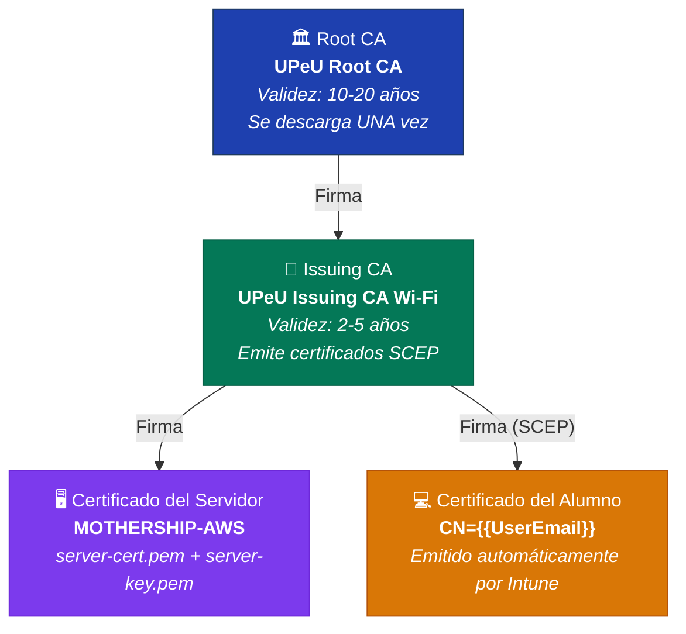
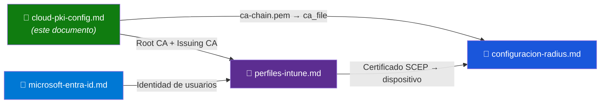

# Microsoft Cloud PKI — Infraestructura de Certificados

> **Rol:** PKI jerárquica de dos niveles para autenticación EAP-TLS
> **Referencia:** [Microsoft Cloud PKI Documentation](https://learn.microsoft.com/en-us/mem/intune/protect/microsoft-cloud-pki-overview)
> **Siguiente:** [perfiles-intune.md](perfiles-intune.md) → [configuracion-radius.md](../02-mothership-aws/configuracion-radius.md)

---

## Jerarquía de Certificados

La PKI de la UPeU sigue una estructura jerárquica de dos niveles gestionada completamente desde Microsoft Cloud:



> [!IMPORTANT]
> **Cadena de confianza:** FreeRADIUS valida que el certificado del alumno esté firmado por la Issuing CA, que a su vez está firmada por la Root CA. Si algún eslabón de la cadena falta en el servidor, **todos los dispositivos serán rechazados**.

---

## Paso 1: Crear Root CA (Una sola vez)

1. Accede al [Centro de administración de Microsoft Intune](https://intune.microsoft.com/)
2. Navega a **Administración del inquilino** → **Cloud PKI**
3. Clic en **Crear** → **Entidad de certificación raíz**

| Campo | Valor | Notas |
|---|---|---|
| **Nombre común (CN)** | `UPeU Root CA` | Identificador de la CA raíz |
| **Periodo de validez** | 10 o 20 años | Recomendado largo para la raíz |
| **Algoritmo de firma** | RSA 4096 o ECDSA P-256 | RSA 4096 para máxima compatibilidad |

4. Finaliza el asistente
5. Entra en la CA creada → **Descargar certificado** (archivo `.cer`)

> [!CAUTION]
> El certificado de la Root CA **no se regenera**. Si lo pierdes, deberás recrear toda la jerarquía PKI y re-emitir todos los certificados de los dispositivos.

---

## Paso 2: Crear Issuing CA (Una sola vez)

1. En la misma pantalla de **Cloud PKI** → **Crear** → **Entidad de certificación emisora**

| Campo | Valor | Notas |
|---|---|---|
| **Nombre común (CN)** | `UPeU Issuing CA Wi-Fi` | Identifica el propósito de esta CA |
| **Tipo de CA** | Raíz de Cloud PKI | Seleccionar la Root CA del paso anterior |
| **Periodo de validez** | 2 a 5 años | Renovar antes del vencimiento |

2. En la sección de atributos, **copiar las URLs de CRL y SCEP**:

```
URL CRL:  https://pkicrl.manage.microsoft.com/crl/<TENANT_ID>/...
URL SCEP: https://pkiscep.manage.microsoft.com/scep/<TENANT_ID>/...
```

> [!TIP]
> Guarda estas URLs en un lugar seguro. La **URL SCEP** se usará al configurar el [Perfil SCEP en Intune](perfiles-intune.md).

3. **Descargar el certificado** de la Issuing CA

---

## Paso 3: Desplegar Certificados en la Mothership (AWS)

### 3.1 Transferir desde tu computadora local

```bash
# Desde tu PC local (donde descargaste los .cer)
# Reemplaza las variables con tus valores reales
scp -i "<RUTA_LLAVE_PEM>" \
    <RUTA_LOCAL>/UPeU_Root_CA.cer \
    <RUTA_LOCAL>/UPeU_Issuing_CA.cer \
    ubuntu@<IP_ELASTICA_MOTHERSHIP>:~/
```

### 3.2 Instalar en el servidor AWS

```bash
# Crear directorio dedicado para certificados UPeU
sudo mkdir -p /etc/freeradius/3.0/certs/upeu

# Mover certificados descargados
sudo mv ~/UPeU_Root_CA.cer /etc/freeradius/3.0/certs/upeu/ca-root.pem
sudo mv ~/UPeU_Issuing_CA.cer /etc/freeradius/3.0/certs/upeu/ca-issuing.pem

# Asignar propiedad al usuario de FreeRADIUS
sudo chown -R freerad:freerad /etc/freeradius/3.0/certs/upeu

# Permisos restrictivos (solo FreeRADIUS puede leer las llaves)
sudo chmod 640 /etc/freeradius/3.0/certs/upeu/*.pem
sudo chmod 600 /etc/freeradius/3.0/certs/upeu/server-key.pem
```

### 3.3 Crear el archivo de cadena y verificar

La PKI de Microsoft Cloud PKI es de **dos niveles** (Root CA → Issuing CA). FreeRADIUS necesita ambas CAs en `ca_file` para validar los certificados de cliente. Crear el archivo de cadena antes de arrancar el servicio:

```bash
# Concatenar Root CA + Issuing CA en un único archivo de cadena
sudo bash -c "cat /etc/freeradius/3.0/certs/upeu/ca-root.pem \
                   /etc/freeradius/3.0/certs/upeu/ca-issuing.pem \
              > /etc/freeradius/3.0/certs/upeu/ca-chain.pem"

# Asignar propiedad y permisos
sudo chown freerad:freerad /etc/freeradius/3.0/certs/upeu/ca-chain.pem
sudo chmod 640 /etc/freeradius/3.0/certs/upeu/ca-chain.pem
```

Este archivo es el que se referencia como `ca_file` en `configuracion-radius.md` (sección 3.2).

```bash
# Verificar la cadena completa (Root CA → Issuing CA → server-cert)
sudo openssl verify \
    -CAfile /etc/freeradius/3.0/certs/upeu/ca-root.pem \
    -untrusted /etc/freeradius/3.0/certs/upeu/ca-issuing.pem \
    /etc/freeradius/3.0/certs/upeu/server-cert.pem

# Resultado esperado: "server-cert.pem: OK"
```

> [!IMPORTANT]
> Si el comando sin `-untrusted` falla con `unable to get local issuer certificate`, es normal: el certificado del servidor fue emitido por la **Issuing CA**, no directamente por la Root CA. El comando con `-untrusted` es el correcto para una PKI de dos niveles.

---

## Inventario de Certificados en la Mothership

| Archivo | Origen | Ruta en AWS | Permisos | Uso en EAP |
|---|---|---|---|---|
| `ca-root.pem` | Descargado de Cloud PKI (Root CA) | `/etc/freeradius/3.0/certs/upeu/ca-root.pem` | `640` | Componente de `ca-chain.pem` |
| `ca-issuing.pem` | Descargado de Cloud PKI (Issuing CA) | `/etc/freeradius/3.0/certs/upeu/ca-issuing.pem` | `640` | Componente de `ca-chain.pem` |
| `ca-chain.pem` | Generado concatenando Root + Issuing (paso 3.3) | `/etc/freeradius/3.0/certs/upeu/ca-chain.pem` | `640` | **`ca_file`** en `tls-config tls-common` |
| `server-cert.pem` | Certificado del servidor RADIUS | `/etc/freeradius/3.0/certs/upeu/server-cert.pem` | `640` | `certificate_file` |
| `server-key.pem` | Llave privada del servidor | `/etc/freeradius/3.0/certs/upeu/server-key.pem` | `600` | `private_key_file` |
| `dh` | Generado con `openssl dhparam` | `/etc/freeradius/3.0/certs/dh` | `640` | `dh_file` |

> [!WARNING]
> **`server-key.pem` debe tener permisos `600`** (solo lectura para el propietario). Si un atacante obtiene esta llave, puede suplantar al servidor RADIUS y ejecutar un ataque Evil Twin.

---

## Relación con Otros Documentos



| Paso | Documento |
|---|---|
| 1. Crear Root CA + Issuing CA | **Este documento** |
| 2. Distribuir certificados a dispositivos | [perfiles-intune.md](perfiles-intune.md) |
| 3. Instalar CA en FreeRADIUS | [configuracion-radius.md](../02-mothership-aws/configuracion-radius.md) (sección 3.2) |
| 4. Configurar identidad de usuarios | [microsoft-entra-id.md](microsoft-entra-id.md) |
