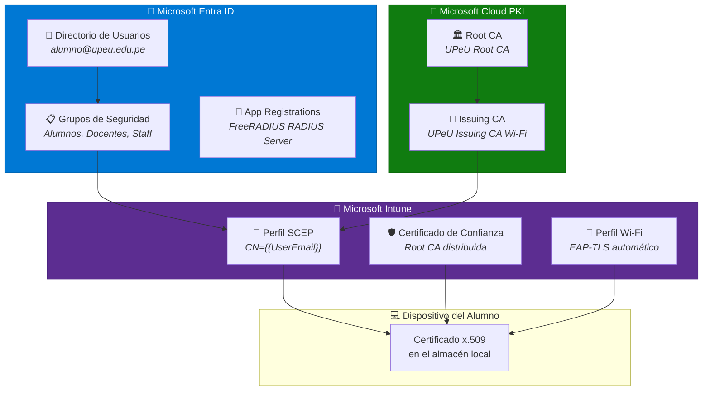
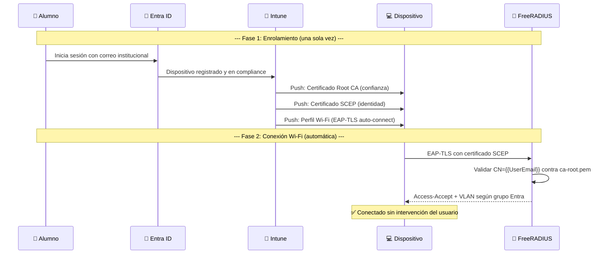

# Microsoft Entra ID — Identidad Zero Trust

> **Componente:** Proveedor de Identidad (IdP) de la UPeU  
> **Referencia:** [Microsoft Entra ID Documentation](https://learn.microsoft.com/en-us/entra/identity/)  
> **Estado:** 🔶 Parcialmente implementado (autenticación por certificado activa, integración LDAP pendiente)

---

## Rol en la Arquitectura InkBridge

Microsoft Entra ID es la **fuente de verdad de identidades** en el modelo Zero Trust de la UPeU. Todos los usuarios, grupos y dispositivos se gestionan desde Entra ID, y la autenticación a la red Wi-Fi se delega a certificados emitidos por su brazo PKI.



---

## Flujo de Identidad End-to-End



---

## Implementación Actual

### ✅ Completado
- [x] Cloud PKI configurada (Root CA + Issuing CA) → Ver [cloud-pki-config.md](cloud-pki-config.md)
- [x] Perfiles SCEP y Certificado de Confianza en Intune → Ver [perfiles-intune.md](perfiles-intune.md)
- [x] FreeRADIUS Mothership valida certificados emitidos por Cloud PKI
- [x] Certificados del servidor (`server-key.pem`, `server-cert.pem`) instalados en AWS

### 🔶 Pendiente: App Registration

Para una integración más robusta, se recomienda crear un **App Registration** en Entra ID que represente al servidor FreeRADIUS:

| Tarea | Descripción | Prioridad |
|---|---|---|
| Crear App Registration | Registrar `FreeRADIUS-UPeU` como aplicación empresarial | Media |
| Configurar App Proxy | Si se necesita acceso LDAP desde AWS sin VPN | Baja |
| Integración LDAP directa | Consultar grupos de Entra para asignación dinámica de VLAN | Alta |
| Mapeo de grupos → VLAN | `Alumnos` → VLAN 100, `Docentes` → VLAN 200, `Staff` → VLAN 300 | Alta |

### Configuración Futura de LDAP

Cuando se implemente la integración LDAP, el módulo `ldap` de FreeRADIUS se configurará así:

```ini
# /etc/freeradius/3.0/mods-available/ldap (BORRADOR — NO activar aún)
ldap {
    server   = "ldaps://ldap.<TENANT_ENTRA>.onmicrosoft.com"
    port     = 636
    identity = "CN=<APP_REGISTRATION_ID>,OU=Applications,DC=upeu,DC=edu,DC=pe"
    password = <LDAP_BIND_PASSWORD>
    base_dn  = "DC=upeu,DC=edu,DC=pe"

    # Mapeo de grupos a atributos RADIUS
    group {
        base_dn   = "${..base_dn}"
        filter    = "(objectClass=group)"
        membership_attribute = "memberOf"
    }
}
```

> [!CAUTION]
> La integración LDAP directa con Entra ID requiere **Microsoft Entra Domain Services** o un **App Proxy con connector**. No es posible hacer LDAP bind directamente contra Entra ID cloud sin estos componentes.

---

## Principios Zero Trust Aplicados

| Principio | Implementación en UPeU |
|---|---|
| **Verificar explícitamente** | Cada dispositivo presenta un certificado x.509 único |
| **Acceso con privilegio mínimo** | VLAN asignada según grupo de Entra → solo acceso necesario |
| **Asumir la brecha** | Session Tickets con TTL de 24h; revocación por CRL en Cloud PKI |
| **Sin contraseñas** | EAP-TLS exclusivo; PEAP/MSCHAPv2 deshabilitados en la Mothership |

---

→ **Siguiente paso:** Verificar que los certificados se distribuyen correctamente en [perfiles-intune.md](perfiles-intune.md), luego validar la autenticación en [configuracion-radius.md](../02-mothership-aws/configuracion-radius.md).
