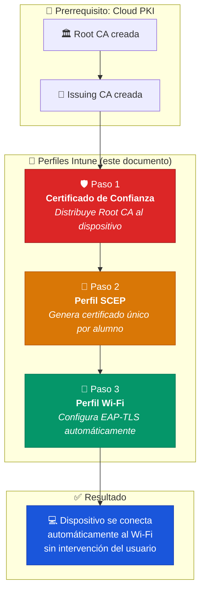
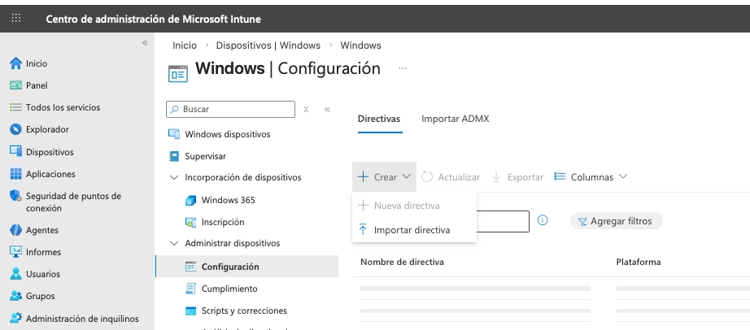
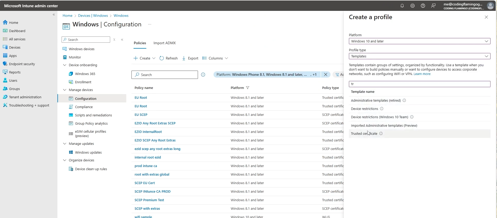
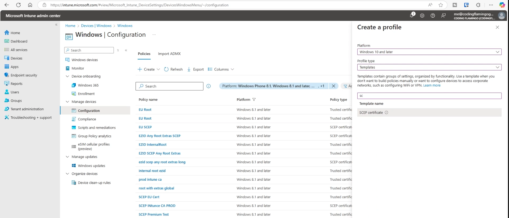
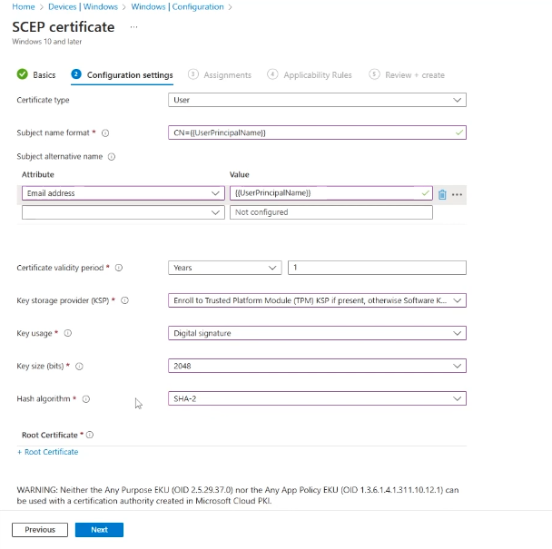
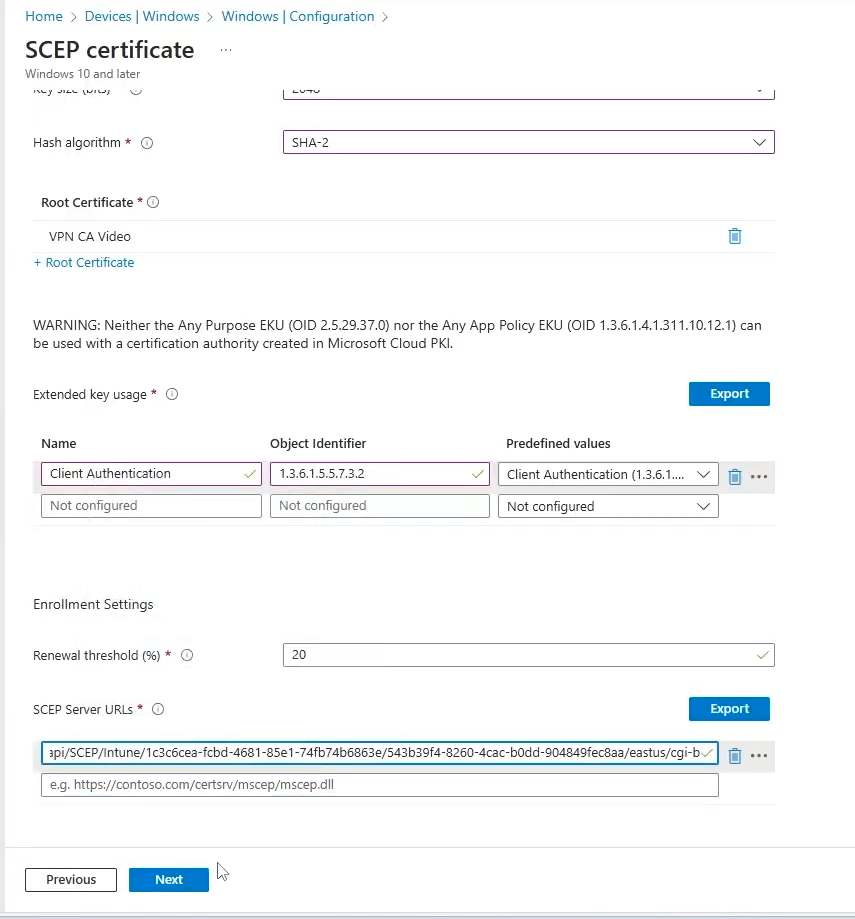
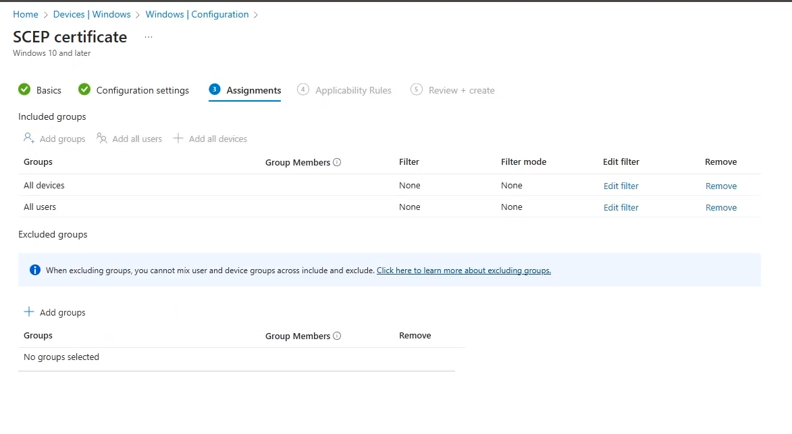
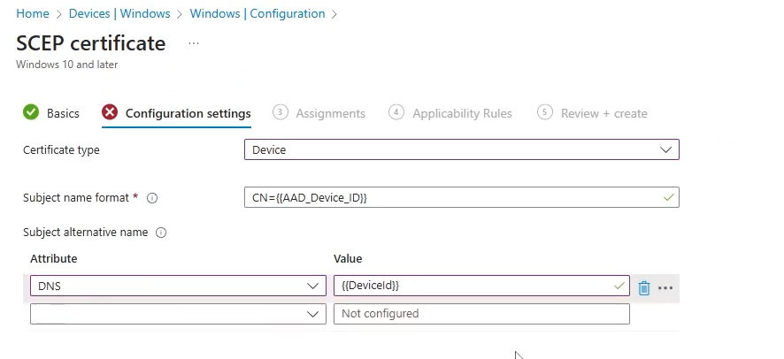
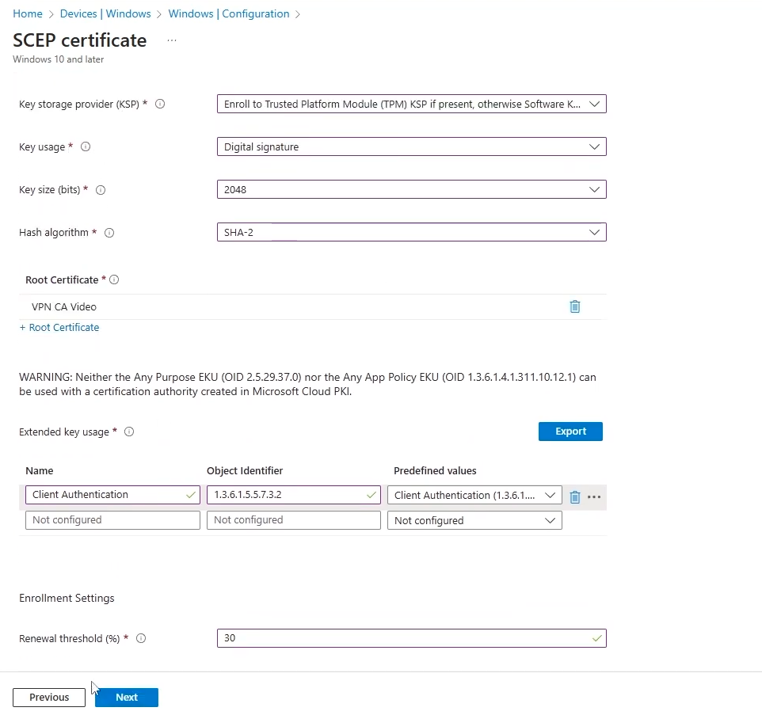
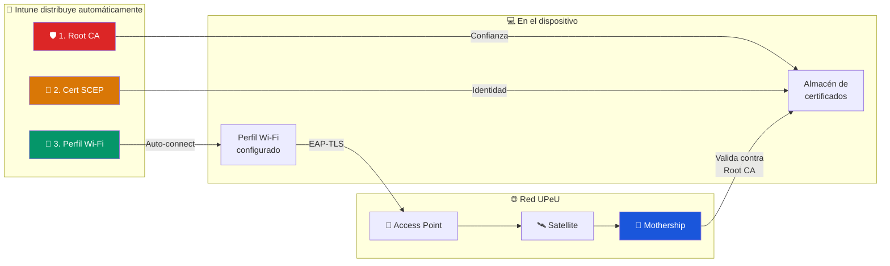

# Perfiles Intune — Distribución de Certificados y Wi-Fi

> **Componente:** Microsoft Intune (Endpoint Manager)  
> **Flujo:** Root CA → Issuing CA → Certificado de Confianza → Perfil SCEP → Perfil Wi-Fi  
> **Principio InkBridge:** Zero Trust — Distribución automática sin intervención del usuario

---

## Flujo de Distribución End-to-End



> [!IMPORTANT]
> **Orden obligatorio:** Los perfiles deben crearse y asignarse en estricto orden (1→2→3). Intune no puede generar un certificado SCEP sin confiar primero en la Root CA, y no puede configurar Wi-Fi sin un certificado SCEP existente.

---

## Checklist de Implementación

- [ ] **Paso 1:** Certificado de Confianza (Root CA)
- [ ] **Paso 2:** Perfil SCEP (certificado del alumno)
- [ ] **Paso 3:** Perfil Wi-Fi (EAP-TLS auto-connect)
- [ ] Asignar los 3 perfiles al grupo de prueba
- [ ] Verificar despliegue en un dispositivo de prueba
- [ ] Verificar autenticación contra la Mothership
- [ ] Promover a grupo de producción

---

## Paso 1: Certificado de Confianza (Root CA)

**Objetivo:** El dispositivo del alumno confía en la Root CA de la UPeU. Sin esto, el dispositivo rechazará el certificado del servidor FreeRADIUS durante el handshake EAP-TLS.

### Ruta en Intune
**Dispositivos** → **Configuración** → **+ Crear** → **Nueva directiva**



### Configuración

| Campo | Valor |
|---|---|
| **Plataforma** | Windows 10 y versiones posteriores |
| **Tipo de perfil** | Plantillas (Templates) → **Certificado de confianza** |
| **Nombre** | `UPeU - Certificado Raíz de Confianza` |
| **Archivo .cer** | `UPeU_Root_CA.cer` (descargado en [cloud-pki-config.md](cloud-pki-config.md)) |
| **Almacén de destino** | Entidad de certificación raíz del equipo |



### Asignación
Asignar a un grupo de seguridad de Entra ID (ej: `GRP-WiFi-Pilot-UPeU`)

> [!TIP]
> Crear un grupo de prueba pequeño (5-10 dispositivos) antes de desplegar a toda la universidad.

---

## Paso 2: Perfil SCEP (Certificado del Alumno)

**Objetivo:** Generar un certificado x.509 único por alumno/dispositivo. Este certificado es la **credencial Zero Trust** que reemplaza las contraseñas.

### Referencias Externas
- 📖 [How-To: Create Intune SCEP Profiles for Windows Devices (Keytos)](https://www.keytos.io/docs/azure-pki/how-to-create-scep-ca-in-azure/how-to-issue-certificates-with-mdm/intune-certificate-authority/create-intune-certificate-profiles/create-windows-intune-scep-profiles/)
- 🎥 [Video: Network Certificate Based Auth with Intune and Cloud RADIUS in UniFi](https://www.youtube.com/watch?v=2kijpP0gpk8)

### Ruta en Intune
**Dispositivos** → **Configuración** → **+ Crear** → **Nueva directiva**

### Configuración

| Campo | Valor | Justificación |
|---|---|---|
| **Plataforma** | Windows 10+ | Compatible con Windows 10/11 |
| **Tipo de perfil** | Plantillas → **Certificado SCEP** | SCEP para emisión automática |
| **Tipo de certificado** | **Usuario** | Se liga al correo del alumno |
| **Formato del nombre del sujeto** | `CN={{UserEmail}}` | FreeRADIUS usa el CN para identificar al usuario |
| **Nombre alternativo del sujeto** | UPN: `{{UserPrincipalName}}` | Identificador secundario en Entra ID |
| **Periodo de validez** | 1 año | Balance entre seguridad y conveniencia |
| **KSP** | Software (o TPM si disponible) | TPM ofrece mayor seguridad hardware |
| **Uso de claves** | Firma digital + Cifrado de claves | Requerido para handshake TLS mutuo |
| **Uso extendido de claves** | **Autenticación de cliente** | El certificado es del cliente, no del servidor |
| **Certificado de confianza raíz** | Seleccionar perfil del **Paso 1** | Vincula la cadena de confianza |
| **URL del servidor SCEP** | URL de la Issuing CA | Copiada durante la creación de la [Issuing CA](cloud-pki-config.md) |







### Asignación

Asignar al **mismo grupo** que el Paso 1. Intune aplica automáticamente ambos perfiles.



> [!IMPORTANT]
> **Asignación dual:** Algunos escenarios requieren asignar tanto a **usuarios** como a **dispositivos**. Si la asignación es solo a usuarios, los dispositivos compartidos no recibirán certificado. Si es solo a dispositivos, no se incluirá el `{{UserEmail}}` en el CN.





---

## Paso 3: Perfil Wi-Fi (EAP-TLS Auto-Connect)

**Objetivo:** Configurar el dispositivo para que se conecte automáticamente a la red Wi-Fi de la UPeU usando el certificado SCEP del Paso 2. **El usuario no necesita hacer nada.**

> [!NOTE]
> **Estado:** 🔶 Pendiente de implementación completa. A continuación se documenta la configuración esperada.

### Ruta en Intune
**Dispositivos** → **Configuración** → **+ Crear** → **Nueva directiva**

### Configuración Esperada

| Campo | Valor | Justificación |
|---|---|---|
| **Plataforma** | Windows 10+ | |
| **Tipo de perfil** | Plantillas → **Wi-Fi** | Perfil nativo de conexión Wi-Fi |
| **Tipo de Wi-Fi** | **Empresarial** | Habilita opciones de EAP |
| **Nombre de la red (SSID)** | `<SSID_WIFI_UPEU>` | Nombre de la red Wi-Fi corporativa |
| **Conectar automáticamente** | **Sí** | Zero touch para el usuario |
| **Tipo EAP** | **EAP-TLS** | Autenticación por certificado |
| **Certificado raíz de confianza** | Perfil del **Paso 1** | Para validar el servidor RADIUS |
| **Certificado de cliente** | Perfil SCEP del **Paso 2** | Credencial del alumno |
| **Método de autenticación** | Certificado de usuario | |

### Checklist de Implementación

- [ ] Crear perfil Wi-Fi empresarial en Intune
- [ ] Configurar EAP-TLS como método de autenticación
- [ ] Seleccionar el perfil de Certificado de Confianza (Paso 1) como validación del servidor
- [ ] Seleccionar el perfil SCEP (Paso 2) como credencial del cliente
- [ ] Activar conexión automática
- [ ] Asignar al mismo grupo de seguridad
- [ ] Probar en dispositivo piloto antes de despliegue masivo

---

## Verificación Post-Despliegue

### En el dispositivo del alumno

```powershell
# Verificar que el certificado Root CA está instalado
certutil -store Root "UPeU Root CA"

# Verificar que el certificado SCEP está instalado
certutil -store My
# Buscar un certificado con CN=alumno@upeu.edu.pe
```

### En la Mothership (AWS)

Después de que el dispositivo se conecte al Wi-Fi:

```bash
# Buscar autenticación exitosa
sudo tail -f /var/log/freeradius/radius.log | grep "Access-Accept"

# Verificar el CN del certificado presentado
sudo tail -f /var/log/freeradius/radius.log | grep "CN="
```

---

## Diagrama Resumen: Los 3 Perfiles en Acción


