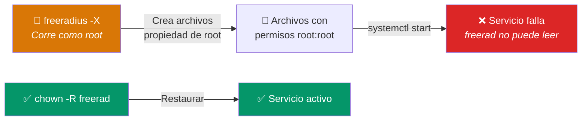

# Mantenimiento del Sistema — Runbook Operativo

> **Alcance:** Ambos servidores (Mothership + Satellites)  
> **Frecuencia:** Semanal (revisión) + mensual (actualizaciones) + diaria (automática via cron)  
> **Principio:** Validar siempre antes de reiniciar (`freeradius -CX`)

---

## Calendario de Mantenimiento

| Tarea | Frecuencia | Servidor | Automatizada |
|---|---|---|---|
| Limpieza de caché TLS | Diaria (03:00 AM) | Mothership | ✅ Cronjob |
| Rotación de logs | Semanal | Ambos | ✅ logrotate |
| Verificar estado del servicio | Diaria | Ambos | ⬜ Manual |
| Actualización del SO | Mensual | Ambos | ⬜ Manual |
| Renovar certificados | Anual | Mothership | ⬜ Manual |
| Revisar permisos post-debug | Después de cada debug | Ambos | ⬜ Manual |

---

## 1. Gestión del Servicio

### Comandos de Operación

```bash
# --- CICLO DE VIDA DEL SERVICIO ---
sudo systemctl start freeradius       # Iniciar
sudo systemctl stop freeradius        # Detener
sudo systemctl restart freeradius     # Reiniciar (downtime breve)
sudo systemctl reload freeradius      # Recargar config sin downtime
sudo systemctl enable freeradius      # Habilitar arranque automático
sudo systemctl disable freeradius     # Deshabilitar arranque automático

# --- DIAGNÓSTICO ---
sudo systemctl status freeradius      # Estado actual
sudo systemctl is-active freeradius   # Solo: active/inactive
sudo systemctl is-enabled freeradius  # Solo: enabled/disabled
```

### Pre-vuelo Obligatorio

> [!CAUTION]
> **NUNCA** reinicies FreeRADIUS sin validar primero la configuración. Un error de sintaxis dejará a toda la universidad sin Wi-Fi.

```bash
# Paso 1: Validar (OBLIGATORIO antes de cualquier restart)
sudo freeradius -CX

# Paso 2: Solo si dice "Configuration appears to be OK"
sudo systemctl restart freeradius

# Paso 3: Confirmar
sudo systemctl status freeradius
```

---

## 2. Rotación de Logs

### Verificar estado actual

```bash
# Tamaño del log principal
du -sh /var/log/freeradius/radius.log

# Cantidad de archivos de log antiguos
ls -la /var/log/freeradius/radius.log*
```

### Configurar logrotate

📄 **Archivo:** `/etc/logrotate.d/freeradius`

```bash
sudo nano /etc/logrotate.d/freeradius
```

```ini
# Rotación semanal de logs de FreeRADIUS
# Mantiene 12 semanas (~3 meses) de historial comprimido
/var/log/freeradius/radius.log {
    weekly                  # Rotar cada semana
    rotate 12               # Mantener 12 archivos (3 meses)
    compress                # Comprimir logs antiguos con gzip
    delaycompress           # No comprimir el más reciente
    missingok               # No fallar si el archivo no existe
    notifempty              # No rotar si el archivo está vacío
    create 640 freerad freerad  # Permisos del nuevo archivo
    postrotate
        # Recargar FreeRADIUS para que abra el nuevo archivo de log
        systemctl reload freeradius > /dev/null 2>&1 || true
    endscript
}
```

### Verificar que logrotate funciona

```bash
# Simulación (no ejecuta, solo muestra qué haría)
sudo logrotate -d /etc/logrotate.d/freeradius

# Ejecución forzada (para probar)
sudo logrotate -f /etc/logrotate.d/freeradius
```

---

## 3. Limpieza de Caché TLS

### Verificar estado de la caché

```bash
# Contar sesiones almacenadas
sudo ls -1 /var/log/freeradius/tlscache 2>/dev/null | wc -l

# Espacio en disco
sudo du -sh /var/log/freeradius/tlscache

# Ver sesiones más antiguas
sudo ls -lat /var/log/freeradius/tlscache | tail -5
```

### Limpieza manual (emergencia)

```bash
# Limpiar archivos con más de 2 días
sudo find /var/log/freeradius/tlscache -type f -mtime +2 -delete

# Limpiar TODA la caché (fuerza re-autenticación de todos los usuarios)
sudo rm -rf /var/log/freeradius/tlscache/*
sudo systemctl restart freeradius
```

> [!WARNING]
> Limpiar toda la caché fuerza a **todos los dispositivos** a realizar un handshake EAP-TLS completo. En un campus con 5,000 alumnos, esto genera una ráfaga masiva de peticiones a AWS. Hazlo solo fuera de horario de clases.

### Verificar cronjob de limpieza automática

```bash
# Listar tareas del crontab de root
sudo crontab -l

# Debe mostrar:
# 0 3 * * * find /var/log/freeradius/tlscache -type f -mtime +2 -delete
```

---

## 4. Restauración de Permisos

El problema más común después de usar el modo debug (`-X`):



### Solución

```bash
# Restaurar permisos de TODA la configuración
sudo chown -R freerad:freerad /etc/freeradius/3.0/

# Restaurar permisos de logs y caché
sudo chown -R freerad:freerad /var/log/freeradius/

# Permisos específicos de la llave privada (restringida)
sudo chmod 600 /etc/freeradius/3.0/certs/upeu/server-key.pem

# Permisos de la caché (solo FreeRADIUS)
sudo chmod 700 /var/log/freeradius/tlscache
```

---

## 5. Actualizaciones del Sistema Operativo

### Procedimiento seguro

```bash
# Paso 1: Verificar actualizaciones disponibles
sudo apt update
apt list --upgradable

# Paso 2: Aplicar actualizaciones (preferible fuera de horario)
sudo apt upgrade -y

# Paso 3: Verificar si se requiere reinicio
cat /var/run/reboot-required 2>/dev/null && echo "⚠️  REINICIO REQUERIDO" || echo "✅ No requiere reinicio"

# Paso 4: Si requiere reinicio
sudo reboot

# Paso 5: Después de reiniciar, verificar servicio
sudo systemctl status freeradius
```

> [!IMPORTANT]
> **Ventana de mantenimiento:** Realizar actualizaciones del SO solo en horario de baja actividad (después de las 22:00 o fines de semana). En la Mothership, coordinar con los Satellites para minimizar el impacto.

---

## 6. Modo Debug (Procedimiento Estándar)

```bash
# ============================================================
#  PROCEDIMIENTO OPERATIVO: Modo Debug
#  ⚠️  Interrumpe el servicio. Solo usar para diagnóstico.
# ============================================================

# 1. Detener servicio
sudo systemctl stop freeradius

# 2. Eliminar procesos residuales
sudo pkill -9 freeradius 2>/dev/null

# 3. Verificar puertos libres
sudo ss -lupn | grep -E '1812|1813'
# (no debe devolver nada)

# 4. Lanzar debug
sudo freeradius -X
# Observar salida... Ctrl+C para salir

# 5. OBLIGATORIO: Restaurar permisos después del debug
sudo chown -R freerad:freerad /etc/freeradius/3.0/
sudo chown -R freerad:freerad /var/log/freeradius/

# 6. Reactivar servicio
sudo systemctl start freeradius
sudo systemctl status freeradius
```

---

## Checklist de Mantenimiento Mensual

- [ ] Verificar estado de ambos servidores (`systemctl status`)
- [ ] Revisar tamaño de logs (`du -sh /var/log/freeradius/`)
- [ ] Verificar cronjob de limpieza de caché (`crontab -l`)
- [ ] Aplicar actualizaciones del SO (`apt upgrade`)
- [ ] Verificar certificados (fecha de expiración)
- [ ] Ejecutar reporte diario manualmente (`radius-daily-report.sh`)
- [ ] Documentar cualquier incidente en este repositorio
