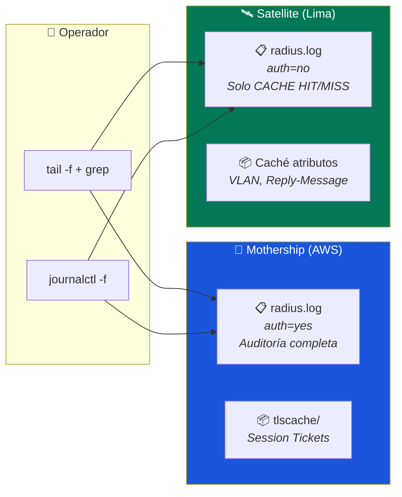

# Monitoreo y Logs — Guía Operativa

> **Alcance:** Mothership (AWS) + Satellites (locales)  
> **Principio InkBridge:** La Mothership centraliza la auditoría; los Satellites solo reportan eventos de caché  
> **Política:** Monitorear sin interrumpir el servicio de producción

---

## Dashboard de Monitoreo Rápido



---

## 1. Escenarios de Monitoreo

### ¿Qué quieres verificar?

| Escenario | Dónde mirar | Comando |
|---|---|---|
| ¿Un alumno se autenticó por primera vez? | **Mothership** | `grep "Access-Accept" radius.log` |
| ¿Un alumno se reconectó desde caché? | **Satellite** | `grep "CACHE HIT" radius.log` |
| ¿Alguien fue rechazado? | **Mothership** | `grep "Access-Reject" radius.log` |
| ¿La Mothership está en silencio? | **Satellite** | Ver si hay `CACHE HIT` → la caché funciona |
| ¿El servicio está caído? | **Ambos** | `systemctl status freeradius` |
| ¿Cuántos usuarios hay en caché? | **Mothership** | `ls -1 tlscache/ \| wc -l` |

---

## 2. Monitoreo en Tiempo Real

### 2.1 Mothership (AWS) — Auditoría Centralizada

```bash
# Ver TODAS las autenticaciones en tiempo real
sudo tail -f /var/log/freeradius/radius.log
```

#### Filtros útiles

```bash
# Solo autenticaciones exitosas (nuevas conexiones)
sudo tail -f /var/log/freeradius/radius.log | grep "Access-Accept"

# Solo rechazos (certificados inválidos, usuarios no autorizados)
sudo tail -f /var/log/freeradius/radius.log | grep "Access-Reject"

# Buscar un usuario específico por su correo
sudo tail -f /var/log/freeradius/radius.log | grep "alumno@upeu.edu.pe"

# Ver desde qué Satellite llegan las peticiones
sudo tail -f /var/log/freeradius/radius.log | grep "SAT-"

# Detectar posibles ataques (intentos fallidos masivos)
sudo tail -f /var/log/freeradius/radius.log | grep -c "Access-Reject"
```

### 2.2 Satellite (Lima) — Eventos de Caché

```bash
# Ver reconexiones desde caché local (Baja Latencia InkBridge)
sudo tail -f /var/log/freeradius/radius.log | grep "CACHE HIT"

# Ver reconexiones de resiliencia (WAN caída, caché activa)
sudo tail -f /var/log/freeradius/radius.log | grep "RESILIENCE"

# Ver peticiones reenviadas a la Mothership (cache MISS)
sudo tail -f /var/log/freeradius/radius.log | grep "Forwarding"
```

**Salidas esperadas:**

```
>>> CACHE HIT: Usuario alumno@upeu.edu.pe autenticado desde caché local en SAT-LIMA-01
```

> [!TIP]
> **Regla de oro InkBridge:** Si el log de la Mothership está en silencio pero los usuarios navegan normalmente, significa que el Satellite está sirviendo desde su caché → el sistema de **Baja Latencia** funciona correctamente.

---

## 3. Logs del Sistema (journalctl)

```bash
# Últimas 50 líneas del servicio
sudo journalctl -u freeradius -n 50

# En tiempo real (equivalente a tail -f pero para systemd)
sudo journalctl -u freeradius -f

# Filtrar por rango de tiempo (ej: primer turno de clases)
sudo journalctl -u freeradius --since "08:00" --until "12:00"

# Filtrar por fecha específica
sudo journalctl -u freeradius --since "2026-02-27 08:00:00"

# Solo errores y warnings
sudo journalctl -u freeradius -p err

# Exportar a archivo para análisis posterior
sudo journalctl -u freeradius --since today > /tmp/radius-hoy.log
```

---

## 4. Verificar Estado de la Infraestructura

### Quick Health Check (ejecutar en ambos servidores)

```bash
# Estado del servicio
sudo systemctl status freeradius

# Verificar que los puertos están escuchando
sudo ss -lupn | grep -E '1812|1813'

# Uso de disco del directorio de logs
du -sh /var/log/freeradius/
```

### Tabla de Referencia Operativa

| Servidor | Hostname | IP | Monitoreo Principal |
|---|---|---|---|
| **Mothership** | `MOTHERSHIP-AWS` | `<IP_ELASTICA_MOTHERSHIP>` | `tail -f radius.log` (auditoría) |
| **Satellite Lima** | `SAT-LIMA-01` | `192.168.62.89` | `tail -f radius.log \| grep "CACHE"` |

---

## 5. Verificar Caché TLS (Mothership)

```bash
# Contar sesiones activas en caché
sudo ls -1 /var/log/freeradius/tlscache 2>/dev/null | wc -l

# Ver detalles de las sesiones más recientes
sudo ls -lat /var/log/freeradius/tlscache | head -10

# Espacio en disco usado por la caché
sudo du -sh /var/log/freeradius/tlscache

# Verificar que el cronjob de limpieza está activo
sudo crontab -l | grep tlscache
```

> [!NOTE]
> Los archivos en `tlscache/` son **Session Tickets** almacenados por `persist_dir`. Se limpian automáticamente cada 24h por el cronjob (archivos +2 días a las 03:00 AM). Ver [configuracion-radius.md](../02-mothership-aws/configuracion-radius.md#4-preparación-del-almacén-de-caché-tls).

---

## 6. Scripts de Monitoreo Automatizado

### Resumen diario (agregar a crontab)

```bash
#!/bin/bash
# /usr/local/bin/radius-daily-report.sh
# Ejecutar: 0 23 * * * /usr/local/bin/radius-daily-report.sh

LOG="/var/log/freeradius/radius.log"
DATE=$(date +%Y-%m-%d)

echo "=== Reporte RADIUS UPeU — $DATE ==="
echo "Autenticaciones exitosas:  $(grep -c 'Access-Accept' $LOG)"
echo "Autenticaciones rechazadas: $(grep -c 'Access-Reject' $LOG)"
echo "Sesiones en caché TLS:     $(ls -1 /var/log/freeradius/tlscache 2>/dev/null | wc -l)"
echo "Tamaño del log:            $(du -sh $LOG | awk '{print $1}')"
echo "Estado del servicio:       $(systemctl is-active freeradius)"
echo "======================================="
```

```bash
# Instalar el script
sudo cp radius-daily-report.sh /usr/local/bin/
sudo chmod +x /usr/local/bin/radius-daily-report.sh

# Agregar al crontab (ejecutar a las 23:00 cada día)
sudo crontab -e
# Agregar: 0 23 * * * /usr/local/bin/radius-daily-report.sh >> /var/log/radius-reports.log
```
