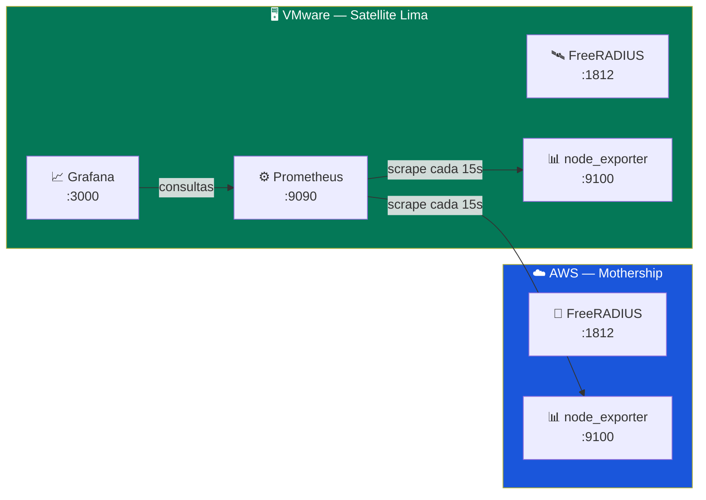

# Monitoreo con Prometheus + Grafana

> **Alcance:** Monitoreo centralizado de Mothership (AWS) + Satellite (Lima)  
> **Stack:** Prometheus + Grafana + Node Exporter (Docker)  
> **Ubicación:** Se ejecuta en el Satellite (VMware) con Docker  
> **Prerequisito:** Docker y Docker Compose instalados

---

## Arquitectura



---

## 1. Instalar Docker (si no está instalado)

```bash
# En el Satellite (vmware01)
curl -fsSL https://get.docker.com | sudo sh
sudo usermod -aG docker $USER

# Cerrar y abrir sesión, o ejecutar:
newgrp docker

# Verificar
docker --version
docker compose version
```

---

## 2. Levantar el Stack de Monitoreo

```bash
# En el Satellite
cd /opt/upeu-mothership-radius/infrastructure/monitoring
sudo docker compose up -d
```

### Verificar que todo está corriendo

```bash
sudo docker compose ps
```

| Contenedor | Puerto | Estado esperado |
|---|---|---|
| `radius-prometheus` | `:9090` | Up |
| `radius-grafana` | `:3000` | Up |
| `radius-node-exporter` | `:9100` | Up |

---

## 3. Instalar Node Exporter en la Mothership (AWS)

Para monitorear la Mothership, necesitas instalar node_exporter directamente (sin Docker):

```bash
# En la Mothership (AWS)
sudo apt-get install -y prometheus-node-exporter
sudo systemctl enable prometheus-node-exporter
sudo systemctl start prometheus-node-exporter

# Verificar
curl -s http://localhost:9100/metrics | head -5
```

### Abrir puerto en Security Group de AWS

| Puerto | Protocolo | Origen | Descripción |
|---|---|---|---|
| 9100 | TCP | `190.239.28.70/32` | Node Exporter (Prometheus) |

> [!CAUTION]
> **NUNCA** abrir el puerto 9100 a `0.0.0.0/0`. Node Exporter expone métricas sensibles del sistema.

---

## 4. Acceder a Grafana

Abrir en el navegador: **http://192.168.62.82:3000**

| Campo | Valor |
|---|---|
| Usuario | `admin` |
| Contraseña | `UPeU-Radius-2026` |

> [!IMPORTANT]
> Cambiar la contraseña en el primer login. La contraseña por defecto está en el `docker-compose.yml`.

Prometheus ya está configurado como datasource automáticamente.

---

## 5. Crear Dashboard en Grafana

### 5.1 Importar un dashboard pre-hecho

1. En Grafana, ir a **Dashboards → Import**
2. Ingresar el ID: **1860** (Node Exporter Full)
3. Seleccionar datasource: **Prometheus**
4. Click **Import**

Esto te da un dashboard completo con CPU, RAM, disco, red, etc.

### 5.2 Queries útiles para paneles personalizados

| Métrica | Query PromQL |
|---|---|
| CPU usage (%) | `100 - (avg by(instance)(rate(node_cpu_seconds_total{mode="idle"}[5m])) * 100)` |
| RAM usage (%) | `(1 - (node_memory_MemAvailable_bytes / node_memory_MemTotal_bytes)) * 100` |
| Disco usage (%) | `(1 - (node_filesystem_avail_bytes{mountpoint="/"} / node_filesystem_size_bytes{mountpoint="/"})) * 100` |
| Network IN (bytes/s) | `rate(node_network_receive_bytes_total{device!~"lo\|docker.*"}[5m])` |
| Network OUT (bytes/s) | `rate(node_network_transmit_bytes_total{device!~"lo\|docker.*"}[5m])` |
| Uptime (días) | `(time() - node_boot_time_seconds) / 86400` |
| Server disponible | `up` |

---

## 6. Alertas Configuradas

Las alertas están definidas en `prometheus/alerts.yml` y se activan automáticamente:

| Alerta | Condición | Severidad |
|---|---|---|
| **ServerDown** | Target no responde por 2 min | 🔴 Critical |
| **HighCPU** | CPU > 85% por 5 min | 🟡 Warning |
| **HighMemory** | RAM > 90% por 5 min | 🟡 Warning |
| **DiskSpaceLow** | Disco > 85% | 🟡 Warning |
| **DiskSpaceCritical** | Disco > 95% | 🔴 Critical |
| **HighNetworkTraffic** | > 100MB/s por 5 min | 🟡 Warning |

### Ver alertas activas

- **Prometheus:** http://192.168.62.82:9090/alerts
- **Grafana:** Dashboards → Alerting

---

## 7. Estructura de Archivos

```
infrastructure/monitoring/
├── docker-compose.yml                          # Stack completo
├── prometheus/
│   ├── prometheus.yml                          # Targets y scraping
│   └── alerts.yml                              # Reglas de alertas
└── grafana/
    └── provisioning/
        └── datasources/
            └── datasource.yml                  # Auto-config Prometheus
```

---

## 8. Operaciones Comunes

### Reiniciar el stack

```bash
cd /opt/upeu-mothership-radius/infrastructure/monitoring
sudo docker compose restart
```

### Ver logs de los contenedores

```bash
sudo docker compose logs -f prometheus
sudo docker compose logs -f grafana
```

### Actualizar imágenes

```bash
sudo docker compose pull
sudo docker compose up -d
```

### Detener todo

```bash
sudo docker compose down
# Para borrar datos persistentes también:
sudo docker compose down -v
```

### Recargar configuración de Prometheus (sin reiniciar)

```bash
curl -X POST http://localhost:9090/-/reload
```

---

## 9. Agregar una Nueva Sede al Monitoreo

Cuando se agregue un nuevo Satellite (ej: Juliaca):

1. Instalar `node_exporter` en el nuevo servidor
2. Editar `prometheus/prometheus.yml` y agregar:

```yaml
  - job_name: "satellite-juliaca-system"
    static_configs:
      - targets: ["<IP_SATELLITE_JULIACA>:9100"]
        labels:
          server: "satellite"
          sede: "juliaca"
          role: "satellite"
```

3. Recargar Prometheus:

```bash
curl -X POST http://localhost:9090/-/reload
```

---

→ **Siguiente paso:** Configurar notificaciones por email/Telegram con Alertmanager.
