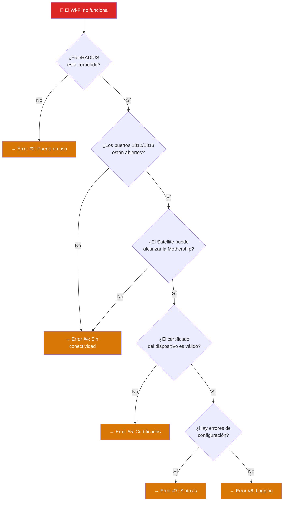
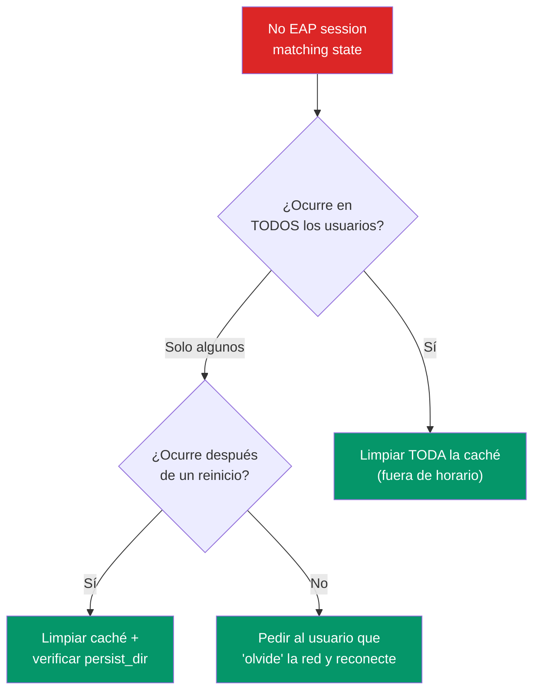
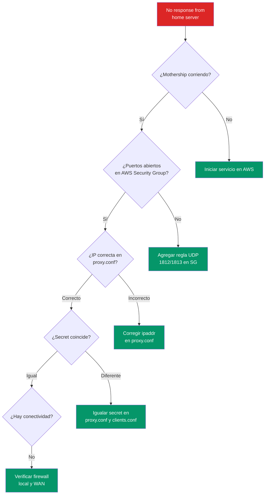
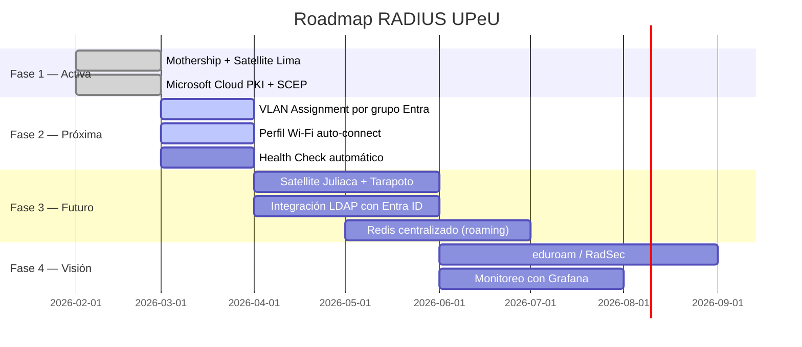

# Troubleshooting — Guía de Resolución de Problemas

> **Alcance:** Toda la infraestructura RADIUS (Mothership + Satellites + Intune + PKI)  
> **Metodología:** Síntoma → Causa raíz → Diagrama de decisión → Solución  
> **Referencia:** [FreeRADIUS Debug Guide](https://wiki.freeradius.org/guide/FAQ)  
> **Regla #1:** Siempre ejecutar `freeradius -CX` antes de reiniciar

---

## Árbol de Decisión General



---

## Error #1: "No EAP session matching state"

### Síntoma
```
ERROR: No EAP session matching state 0xabcdef12
```
Los dispositivos intentan conectarse pero son rechazados.

### Causa Raíz
El servidor no puede encontrar la sesión EAP correspondiente al dispositivo. Ocurre por:
- **Timeout** en la comunicación Satellite ↔ Mothership (latencia WAN > 5s)
- **Caché corrupta** después de un corte de energía
- **Reinicio del servidor** durante un handshake EAP-TLS activo
- **Desincronización** entre el Session Ticket del dispositivo y la caché del servidor

### Diagrama de Resolución



### Solución

```bash
# Opción A: Limpiar caché y reiniciar (afecta a todos los usuarios)
sudo rm -rf /var/log/freeradius/tlscache/*
sudo systemctl restart freeradius

# Opción B: Solo un usuario — pedirle que "olvide" la red Wi-Fi
# En Windows: Configuración → Red → Wi-Fi → Red UPeU → Olvidar
# En macOS: Preferencias → Red → Wi-Fi → Avanzado → Eliminar red
# En iOS/Android: Ajustes → Wi-Fi → Red UPeU → Olvidar

# Opción C: Verificar latencia WAN (si el problema es intermitente)
ping -c 10 <IP_ELASTICA_MOTHERSHIP>
# Si el tiempo > 200ms, considerar aumentar response_window en proxy.conf
```

---

## Error #2: Puerto 1812 ya en uso

### Síntoma
```
Failed binding to auth address * port 1812: Address already in use
```

### Causa Raíz
Un proceso de FreeRADIUS anterior no se cerró correctamente (crash, kill incompleto, doble ejecución).

### Solución

```bash
# 1. Identificar el proceso que ocupa el puerto
sudo ss -lupn | grep 1812

# 2. Forzar cierre
sudo pkill -9 freeradius

# 3. Esperar 2 segundos y verificar
sleep 2
sudo ss -lupn | grep 1812
# (no debe devolver nada)

# 4. Relanzar
sudo freeradius -X    # Modo debug
# O bien:
sudo systemctl start freeradius    # Modo servicio
```

---

## Error #3: Wi-Fi falla después del modo Debug

### Síntoma
El servicio estaba funcionando, se usó `freeradius -X` para diagnóstico, y al volver al modo servicio el Wi-Fi dejó de funcionar.

### Causa Raíz


### Solución

```bash
# Restaurar permisos de toda la configuración y logs
sudo chown -R freerad:freerad /etc/freeradius/3.0/
sudo chown -R freerad:freerad /var/log/freeradius/

# Permisos específicos de la llave privada
sudo chmod 600 /etc/freeradius/3.0/certs/upeu/server-key.pem

# Reiniciar servicio
sudo systemctl start freeradius
```

> [!TIP]
> **Prevención:** Después de cada sesión de debug, **siempre** ejecutar el `chown -R` antes de reactivar el servicio. Ver [mantenimiento.md](../05-operaciones/mantenimiento.md#6-modo-debug-procedimiento-estándar).

---

## Error #4: Satellite no conecta con la Mothership

### Síntoma
```
No response from home server upeu-aws-mothership
```

### Checklist de Verificación (ejecutar en orden)



### Comandos de Verificación

| # | Verificación | Comando (desde el Satellite) |
|---|---|---|
| 1 | Mothership está corriendo | `ssh ubuntu@<IP_MOTHERSHIP> "systemctl is-active freeradius"` |
| 2 | Puerto abierto | `nc -zvu <IP_MOTHERSHIP> 1812` (si nc disponible) |
| 3 | IP en proxy.conf | `grep ipaddr /etc/freeradius/3.0/proxy.conf` |
| 4 | Secret coincide | Comparar `grep secret /etc/freeradius/3.0/proxy.conf` (Satellite) vs `grep secret /etc/freeradius/3.0/clients.conf` (Mothership) |
| 5 | Conectividad básica | `ping -c 3 <IP_ELASTICA_MOTHERSHIP>` |

---

## Error #5: Certificados inválidos / TLS Alert

### Síntoma
```
ERROR: TLS Alert write:fatal:unknown CA
```
```
ERROR: (TLS) recv TLS 1.2 Alert, fatal certificate_unknown
```

### Verificaciones

```bash
# 1. ¿Existen los certificados en la ruta esperada?
ls -la /etc/freeradius/3.0/certs/upeu/
# Debe mostrar: ca-root.pem, ca-issuing.pem, ca-chain.pem, server-cert.pem, server-key.pem

# 2. ¿El archivo DH existe?
ls -la /etc/freeradius/3.0/certs/dh

# 3. ¿Los permisos son correctos?
stat -c '%U:%G %a %n' /etc/freeradius/3.0/certs/upeu/*
# Esperado: freerad:freerad 640 para .pem, 600 para server-key.pem

# 4. ¿La cadena de confianza es válida? (PKI de dos niveles)
sudo openssl verify \
    -CAfile /etc/freeradius/3.0/certs/upeu/ca-root.pem \
    -untrusted /etc/freeradius/3.0/certs/upeu/ca-issuing.pem \
    /etc/freeradius/3.0/certs/upeu/server-cert.pem
# Esperado: "server-cert.pem: OK"
# NOTA: Sin -untrusted, fallará con 'unable to get local issuer certificate'
#       porque server-cert fue firmado por Issuing CA, no por Root CA.
#       Alternativa: usar ca-chain.pem como -CAfile directamente:
#       sudo openssl verify -CAfile .../ca-chain.pem .../server-cert.pem

# 5. ¿El certificado no ha expirado?
sudo openssl x509 -enddate -noout \
    -in /etc/freeradius/3.0/certs/upeu/server-cert.pem
# Verificar que la fecha sea futura

# 6. Regenerar DH si es necesario
sudo openssl dhparam -out /etc/freeradius/3.0/certs/dh 2048
sudo chown freerad:freerad /etc/freeradius/3.0/certs/dh
```

> [!IMPORTANT]
> Si `openssl verify` falla con `unable to get local issuer certificate`, significa que `ca-root.pem` **no es la Root CA correcta** o que falta la Issuing CA en la cadena. Volver a descargar desde [Cloud PKI](../04-identidad-y-pki/cloud-pki-config.md).

---

## Error #6: Log en silencio (sin autenticaciones)

### Síntoma
El servicio está activo pero `radius.log` no muestra ningún evento de autenticación.

### Causa y Solución

**En la Mothership:** La auditoría debe estar habilitada.

```bash
# Verificar configuración de logging
grep -A5 "^log {" /etc/freeradius/3.0/radiusd.conf
```

```ini
# Valores correctos para la Mothership:
log {
    auth = yes              # ← Debe ser "yes"
    auth_badpass = yes      # ← Debe ser "yes" (detectar ataques)
    auth_goodpass = no      # ← Mantener "no" (seguridad)
}
```

**En el Satellite:** `auth = no` es **correcto** (la auditoría la centraliza la Mothership). Los eventos de caché se ven vía `Reply-Message`:

```bash
# En el Satellite, buscar eventos de caché (no de auth)
sudo tail -f /var/log/freeradius/radius.log | grep -E "CACHE|Reply-Message"
```

```bash
# Aplicar cambios
sudo freeradius -CX && sudo systemctl restart freeradius
```

---

## Error #7: Error de sintaxis en configuración

### Síntoma
El servicio no arranca. `systemctl status` muestra `failed`.

### Diagnóstico

```bash
# Este comando muestra EXACTAMENTE el archivo y línea del error
sudo freeradius -CX
```

### Errores comunes de sintaxis

| Error | Causa | Solución |
|---|---|---|
| `Missing closing brace` | Llave `{` abierta sin cerrar | Verificar pares de `{ }` |
| `Invalid keyword` | Directiva mal escrita | Consultar documentación de FreeRADIUS |
| `Failed reading ...` | Archivo no existe en la ruta | Verificar rutas de certificados |
| `Permission denied` | FreeRADIUS no puede leer el archivo | `chown freerad:freerad <archivo>` |

> [!TIP]
> Usa `nano` con `Ctrl+W` para buscar la línea reportada por `-CX`. Los editores con número de línea (`nano -l`) facilitan encontrar el error.

---

## Error #8: Dispositivo se conecta pero pierde conexión periódicamente

### Síntoma
El alumno se conecta, navega unos minutos, y pierde la conexión. Al reconectar funciona de nuevo.

### Causa Raíz
Probablemente los **Session Tickets** expiran prematuramente o el `fragment_size` no es suficiente para los certificados de Microsoft.

### Solución

```bash
# Verificar fragment_size en el módulo EAP
grep fragment_size /etc/freeradius/3.0/mods-available/eap
# Debe ser: fragment_size = 1024 (o mayor)

# Verificar lifetime del cache
grep lifetime /etc/freeradius/3.0/mods-available/eap
# Debe ser: lifetime = 24 (horas)

# Si el problema persiste, aumentar fragment_size
# fragment_size = 1400
```

---

## Roadmap de Mejoras Futuras



### Tareas Pendientes (Detalle)

| Tarea | Prioridad | Documento Relacionado |
|---|---|---|
| **VLAN Assignment:** Configurar `Tunnel-Type`, `Tunnel-Medium-Type`, `Tunnel-Private-Group-ID` según grupo de Entra | 🔴 Alta | [configuracion-radius.md](../02-mothership-aws/configuracion-radius.md) |
| **Perfil Wi-Fi:** Completar Paso 3 en Intune para conexión automática | 🔴 Alta | [perfiles-intune.md](../04-identidad-y-pki/perfiles-intune.md) |
| **Health Check:** Ya configurado `response_window`/`zombie_period` en proxy.conf | ✅ Hecho | [configuracion-proxy.md](../03-satellites-locales/configuracion-proxy.md) |
| **AP UniFi + SSID WPA2-Enterprise** | ✅ Hecho | [configuracion-ap-unifi.md](../03-satellites-locales/configuracion-ap-unifi.md) |
| **Session Tickets (TLS cache en disco)** | ✅ Hecho | [configuracion-radius.md — §3.6](../02-mothership-aws/configuracion-radius.md) |
| **Más Satellites:** Juliaca y Tarapoto con misma configuración de proxy puro | 🟡 Media | [instalacion-ubuntu.md](../03-satellites-locales/instalacion-ubuntu.md) |
| **LDAP/Entra ID:** Mapeo dinámico de grupo → VLAN sin hardcodear | 🟡 Media | [microsoft-entra-id.md](../04-identidad-y-pki/microsoft-entra-id.md) |
| **Redis:** Caché centralizada para roaming entre Satellites | 🟢 Baja | [configuracion-radius.md](../02-mothership-aws/configuracion-radius.md) |
| **eduroam (RadSec):** RADIUS sobre TLS para redes globales universitarias | 🟢 Baja | Nuevo documento necesario |

---

## Errores Descubiertos en Despliegue (Marzo 2026)

### Error #8: `Tried to start unsupported EAP type MSCHAPv2 (26)`

**Síntoma:**
```
Login incorrect (eap: Tried to start unsupported EAP type MSCHAPv2 (26))
```

**Causa raíz:** El archivo EAP tiene configurado PEAP con `default_eap_type = mschapv2`, pero faltan los sub-módulos `md5 {}` y `mschapv2 {}` dentro del bloque `eap {}`.

**Solución:** Agregar los sub-módulos al archivo EAP **Y** habilitar el módulo mschap:

```ini
# Dentro de eap { ... }
md5 {
}

mschapv2 {
}
```

```bash
sudo ln -sf /etc/freeradius/3.0/mods-available/mschap /etc/freeradius/3.0/mods-enabled/mschap
sudo systemctl restart freeradius
```

---

### Error #9: `BLASTRADIUS check: Received response to Access-Request with Message-Authenticator`

**Síntoma:**
```
ERROR: BlastRADIUS check: Setting "require_message_authenticator = true" for home_server upeu-aws-mothership
ERROR: Please set "require_message_authenticator = true" for home_server upeu-aws-mothership
```

**Causa raíz:** La Mothership incluye Message-Authenticator en sus respuestas (correcto), pero el Satellite no tiene configurado `require_message_authenticator = yes` en su `home_server`.

**Solución:** En el Satellite, editar `proxy.conf`:

```ini
home_server upeu-aws-mothership {
    # ... demás configuración ...
    require_message_authenticator = yes    # ← agregar
}
```

---

### Error #10: `TLS Server requires a certificate file`

**Síntoma:**
```
tls: TLS Server requires a certificate file
rlm_eap_tls: Failed initializing SSL context
rlm_eap (EAP): Failed to initialise rlm_eap_tls
```

**Causa raíz:** El archivo EAP por defecto de Ubuntu tiene ~1200 líneas. Al editarlo parcialmente, es fácil dejar directivas duplicadas o fuera de su bloque. FreeRADIUS no puede resolver las rutas del certificado correctamente.

**Solución:** **NO editar el archivo por defecto**. Reescribirlo completo con la configuración mínima validada usando `sudo tee`:

```bash
sudo cp /etc/freeradius/3.0/mods-available/eap /etc/freeradius/3.0/mods-available/eap.bak
sudo tee /etc/freeradius/3.0/mods-available/eap > /dev/null << 'ENDOFFILE'
# ... configuración mínima validada ...
ENDOFFILE
```

> [!TIP]
> Usar `ENDOFFILE` en vez de `EOF` como delimitador del heredoc — algunos shells interpretan `EOF` de forma inesperada si aparece en el contenido.

Ver la configuración completa validada en [configuracion-radius.md — §3.2](../02-mothership-aws/configuracion-radius.md).

