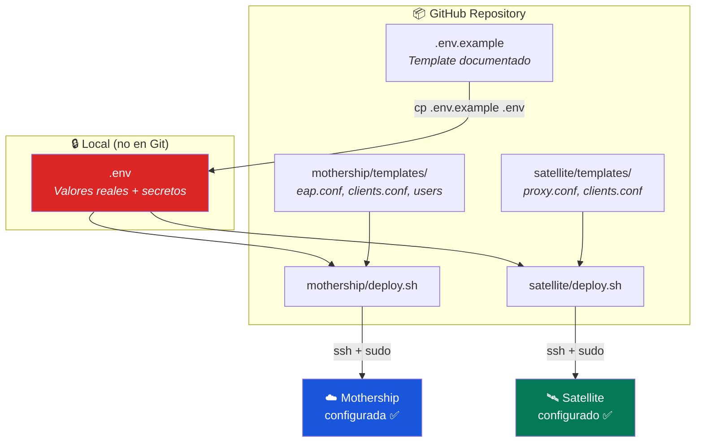

# Guía de Despliegue Automatizado

> **Objetivo:** Desplegar Mothership y Satellites desde cero con un solo comando  
> **Requisitos:** Ubuntu 22.04/24.04 LTS, acceso root, conexión a Internet  
> **Tiempo estimado:** ~5 minutos por servidor  
> **Probado:** FreeRADIUS 3.2.5 (marzo 2026)

---

## Arquitectura del Deploy



### Flujo de autenticación

```
📱 Dispositivo → 📡 AP → 🛰️ Satellite → ☁️ Mothership AWS → ✅ Access-Accept → 🌐 Internet
                  WiFi    192.168.x.x     UDP/1812              Valida usuario
                  PEAP    secret AP↔SAT   secret SAT↔MOTH       EAP-PEAP/MSCHAPv2
```

---

## 0. Preparar un Servidor Limpio (opcional)

Si necesitas empezar de cero en un servidor que ya tenía FreeRADIUS:

```bash
sudo systemctl stop freeradius 2>/dev/null || true
sudo apt-get purge -y freeradius freeradius-utils freeradius-common
sudo apt-get autoremove -y
sudo rm -rf /etc/freeradius /var/log/freeradius
```

---

## 1. Clonar el Repositorio

```bash
sudo apt-get update && sudo apt-get install -y git
cd /opt
sudo git clone https://github.com/UPeU-CRAI/upeu-mothership-radius.git
cd upeu-mothership-radius/deploy
```

---

## 2. Configurar Variables

El sistema utiliza una jerarquía de archivos para facilitar la gestión de múltiples sedes:

```
deploy/
├── global.env              # Configuración compartida (TLS, Timeouts)
├── mothership/
│   ├── .env.example        # Template documentado
│   ├── .env                # 🔒 Valores reales (no en Git)
│   └── templates/          # Templates de FreeRADIUS
└── satellite/
    ├── .env.example        # Template documentado
    ├── instances/          # 🔒 Una config por sede (no en Git)
    │   └── lima.env
    └── templates/          # Templates de FreeRADIUS
```

> **Importante:** Los archivos `.env` contienen secretos y están en `.gitignore`. NUNCA se suben a Git. Cada vez que clonas el repo en un servidor nuevo, debes crear el `.env` manualmente.

### 2.1 Configuración Global

Revisar `deploy/global.env` para ajustes generales de seguridad TLS y parámetros de proxy. Raramente necesita cambios entre sedes.

### 2.2 Configuración de la Mothership

```bash
cd deploy/mothership
cp .env.example .env
nano .env
```

Para registrar Satellites, usa el formato correlativo:

```ini
SAT_1_NAME=SAT-LIMA-01
SAT_1_SHORTNAME=SAT-LIMA-01
SAT_1_PUBLIC_IP=190.239.28.70
SAT_1_SECRET=<GENERAR_CON_dd_if_dev_random>

SAT_2_NAME=SAT-JULIACA-01
SAT_2_SHORTNAME=SAT-JULIACA-01
SAT_2_PUBLIC_IP=<IP_PUBLICA_JULIACA>
SAT_2_SECRET=<GENERAR_CON_dd_if_dev_random>
```

### 2.3 Configuración de Satellites (Sedes)

```bash
cd deploy/satellite
# Crear instancia para una nueva sede
cp .env.example instances/lima.env
nano instances/lima.env
```

> [!TIP]
> Generar secretos robustos: `dd if=/dev/random bs=1 count=24 2>/dev/null | base64`

---

## 3. Desplegar la Mothership (⚠️ SIEMPRE PRIMERO)

> [!WARNING]
> La Mothership debe estar operativa antes de desplegar Satellites, ya que estos validan la conexión al arrancar.

```bash
cd /opt/upeu-mothership-radius/deploy
sudo bash mothership/deploy.sh
```

### Qué hace el script

| Paso | Acción |
|---|---|
| 1 | Carga `global.env` y `mothership/.env` |
| 2 | Instala FreeRADIUS si no existe |
| 3 | Genera certificados temporales y parámetros DH |
| 4 | Configura EAP (mods-available/eap) |
| 5 | **Dinámico:** Genera bloques de clientes en `clients.conf` para cada `SAT_N_*` |
| 6 | Configura usuarios en `mods-config/files/authorize` |
| 7 | Valida con `freeradius -CX` y reinicia |

### Verificar

```bash
# Test local
radtest test1 2026 127.0.0.1 0 testing123
# Esperado: Access-Accept
```

### Firewall AWS (Security Group)

Antes de desplegar Satellites, verificar que el Security Group de la EC2 tiene estas reglas Inbound:

| Puerto | Protocolo | Origen | Descripción |
|---|---|---|---|
| 1812 | UDP | `<IP_PUBLICA_SATELLITE>/32` | RADIUS Auth |
| 1813 | UDP | `<IP_PUBLICA_SATELLITE>/32` | RADIUS Acct |

> [!CAUTION]
> **NO** abrir puertos 1812/1813 a `0.0.0.0/0`. Restringir siempre a las IPs públicas de los Satellites.

---

## 4. Desplegar un Satellite (Sede)

El script del Satellite requiere el nombre de la instancia como argumento:

```bash
cd /opt/upeu-mothership-radius/deploy
# El nombre debe coincidir con instances/<nombre>.env
sudo bash satellite/deploy.sh lima
```

### Qué hace el script

| Paso | Acción |
|---|---|
| 1 | Carga `global.env` y `satellite/instances/[nombre].env` |
| 2 | Instala FreeRADIUS si no existe |
| 3 | Configura `proxy.conf` para apuntar a la Mothership |
| 4 | Configura `clients.conf` con la subred de APs de la sede |
| 5 | Valida con `freeradius -CX` y reinicia |

---

## 5. Verificar el Despliegue

### Desde el Satellite

```bash
# Test del túnel completo (local → proxy → Mothership → respuesta)
radtest test1 2026 127.0.0.1 0 testing123
# Esperado: Access-Accept
```

### Verificar proxy activo

```bash
# Debe mostrar "Marking home server ... alive"
sudo tail -f /var/log/freeradius/radius.log
```

### Desde un dispositivo real

1. Configurar un AP con WPA2-Enterprise:
   - **RADIUS Server:** IP local del Satellite
   - **Puerto:** 1812
   - **Secret:** El valor de `SECRET_AP_SATELLITE` del `.env`
2. Conectar un dispositivo a la red WiFi
3. Credenciales: usuario y contraseña definidos en el `.env` de la Mothership
4. Aceptar el certificado (autofirmado en modo `temp`)

### Monitorear en tiempo real

```bash
# En el Satellite — ver requests del AP
sudo tcpdump -i any udp port 1812 -n

# En ambos servidores — ver logs de autenticación
sudo tail -f /var/log/freeradius/radius.log
```

---

## 6. Agregar una Nueva Sede

1. **En la Mothership:**
   - Editar `deploy/mothership/.env` y agregar `SAT_N_*` (ej: `SAT_2_NAME`, etc.)
   - Ejecutar `sudo bash mothership/deploy.sh` para registrar la IP de la nueva sede

2. **En el nuevo Satellite:**
   - Clonar el repo: `cd /opt && sudo git clone ...`
   - Crear `deploy/satellite/instances/sede.env` con los datos de la sede
   - Ejecutar `sudo bash satellite/deploy.sh sede`

3. **En AWS:**
   - Agregar la IP pública de la nueva sede al Security Group (puertos 1812/1813 UDP)

---

## Templates y Variables

### Archivos generados por el deploy

| Template | Destino en FreeRADIUS | Variables usadas |
|---|---|---|
| `mothership/templates/eap.conf` | `mods-available/eap` | `EAP_DEFAULT_TYPE`, `CERT_*`, `TLS_*` |
| `mothership/templates/clients.conf` | `clients.conf` | `SAT_N_NAME`, `SAT_N_PUBLIC_IP`, `SAT_N_SECRET` |
| `mothership/templates/users` | `mods-config/files/authorize` | `TEST_USER`, `TEST_PASSWORD` |
| `satellite/templates/proxy.conf` | `proxy.conf` | `MOTHERSHIP_IP`, `SECRET_SATELLITE_MOTHERSHIP`, `PROXY_*` |
| `satellite/templates/clients.conf` | `clients.conf` | `AP_SUBNET`, `AP_SHORTNAME`, `SECRET_AP_SATELLITE` |

> [!IMPORTANT]
> FreeRADIUS 3.x lee usuarios de `mods-config/files/authorize`, **NO** del legacy `/etc/freeradius/3.0/users`.

### Convención de placeholders

Los templates usan `%%VARIABLE%%` (doble porcentaje) para evitar conflictos con la sintaxis `${...}` de FreeRADIUS.

---

## Troubleshooting

### Modo debug (muestra todo el procesamiento)

```bash
sudo systemctl stop freeradius
sudo freeradius -X
# En otra terminal:
radtest test1 2026 127.0.0.1 0 testing123
```

### Errores comunes

| Síntoma | Causa probable | Solución |
|---|---|---|
| `Access-Reject` local en Mothership | Usuarios en ruta incorrecta | Verificar que `mods-config/files/authorize` tiene el usuario |
| `[files] = noop` en debug | Archivo de usuarios vacío o en ruta legacy | Re-ejecutar `mothership/deploy.sh` |
| `No reply from server` (timeout) | Firewall/SG bloqueando UDP 1812 | Verificar Security Group de AWS |
| `Parse error "?[0"` en clients.conf | Códigos ANSI en el archivo generado | Actualizar deploy.sh (bug corregido) |
| Servicio no inicia después de debug | Instancia `-X` sigue corriendo | `sudo pkill -9 freeradius && sudo systemctl restart freeradius` |
| BlastRADIUS warnings en logs | Informativo, no afecta funcionamiento | Agregar `require_message_authenticator = yes` en client localhost |

### Verificar configuración sin reiniciar

```bash
sudo freeradius -CX
# Debe decir: "Configuration appears to be OK"
```

---

→ **Siguiente paso:** Integración con Microsoft Intune y Azure Cloud PKI para autenticación con certificados de dispositivo.
