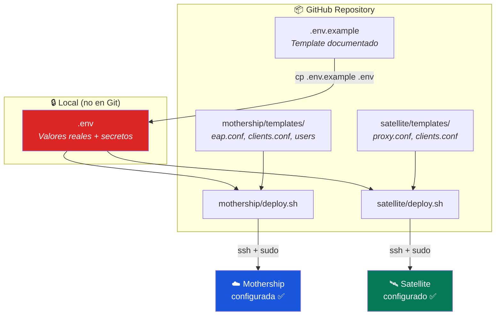

# Guía de Despliegue Automatizado

> **Objetivo:** Desplegar Mothership y Satellites desde cero con un solo comando  
> **Requisitos:** Ubuntu 24.04 LTS, acceso root, conexión a Internet  
> **Tiempo estimado:** ~5 minutos por servidor

---

## Arquitectura del Deploy



---

## 1. Configurar Variables

El sistema utiliza una jerarquía de archivos para facilitar la gestión de múltiples sedes:

```bash
deploy/
├── global.env          # Configuración compartida (TLS, Timeouts)
├── mothership/
│   └── .env            # Configuración de la Mothership + Satellites registrados
└── satellite/
    └── instances/      # Una configuración por sede (lima.env, juliaca.env, etc.)
        └── lima.env
```

### 1.1 Configuración Global
Revisar `deploy/global.env` para ajustes generales de seguridad TLS y parámetros de caché. No suele ser necesario modificarlo entre sedes.

### 1.2 Configuración de la Mothership
```bash
cd deploy/mothership
cp .env.example .env
nano .env
```
Para registrar Satellites, usa el formato correlativo:
```ini
SAT_1_NAME=SAT-LIMA-01
SAT_1_PUBLIC_IP=190.239.28.70
SAT_1_SECRET=...

SAT_2_NAME=SAT-JULIACA-01
SAT_2_PUBLIC_IP=...
SAT_2_SECRET=...
```

### 1.3 Configuración de Satellites (Sedes)
```bash
cd deploy/satellite
# Crear instancia para una nueva sede
cp .env.example instances/juliaca.env
nano instances/juliaca.env
```

---

## 2. Desplegar la Mothership

El script de la Mothership lee el `global.env` y su propio `.env` para reconstruir la configuración completa.

```bash
# En el servidor Mothership
sudo bash mothership/deploy.sh
```

### Qué hace el script
| Paso | Acción |
|---|---|
| 1 | Carga `global.env` y `mothership/.env` |
| 2 | Genera certificados y parámetros DH si no existen |
| 3 | **Dinámico:** Genera bloques de clientes en `clients.conf` para cada Satellite definido (`SAT_N_*`) |
| 4 | Valida con `freeradius -CX` y reinicia |

---

## 3. Desplegar un Satellite (Sede)

El script del Satellite requiere el nombre de la instancia (archivo en `instances/`) como argumento.

```bash
# En el servidor de la sede (ej: Juliaca)
# El nombre debe coincidir con el archivo instances/juliaca.env
sudo bash satellite/deploy.sh juliaca
```

### Qué hace el script
| Paso | Acción |
|---|---|
| 1 | Carga `global.env` y `satellite/instances/[nombre].env` |
| 2 | Configura `proxy.conf` para apuntar a la Mothership |
| 3 | Configura `clients.conf` con los APs de la sede |
| 4 | Valida y reinicia |

---

## 4. Verificar el Despliegue

### Desde el Satellite
```bash
# Test local (hacia el propio FreeRADIUS que reenvía a AWS)
radtest test1 2026 127.0.0.1 0 testing123
# Esperado: Access-Accept
```

### Desde un dispositivo
1. Conectar a la red WiFi `UPeU-Secure` (o el SSID configurado en el AP)
2. Usuario: `test1` / Contraseña: `2026`

---

## 5. Agregar una Nueva Sede

1. **En la Mothership:**
   - Editar `deploy/mothership/.env` y agregar `SAT_N_*` (ej: SAT_2_NAME, etc.)
   - Ejecutar `sudo bash mothership/deploy.sh` para autorizar la IP de la nueva sede.

2. **Para el Satellite:**
   - Crear `deploy/satellite/instances/sede.env` con la IP local y secretos.
   - Copiar carpeta `deploy/` al nuevo servidor.
   - Ejecutar `sudo bash satellite/deploy.sh sede`.

> [!TIP]
> Use `dd if=/dev/random bs=1 count=24 2>/dev/null | base64` para generar secretos robustos entre servers.


---

## Templates y Variables

### Archivos generados por el deploy

| Template | Destino | Variables usadas |
|---|---|---|
| `mothership/templates/eap.conf` | `/etc/freeradius/3.0/mods-available/eap` | `EAP_DEFAULT_TYPE`, `CERT_*`, `TLS_*` |
| `mothership/templates/clients.conf` | `/etc/freeradius/3.0/clients.conf` | `SAT_NAME`, `SAT_PUBLIC_IP`, `SECRET_SATELLITE_MOTHERSHIP` |
| `mothership/templates/users` | `/etc/freeradius/3.0/users` | `TEST_USER`, `TEST_PASSWORD` |
| `satellite/templates/proxy.conf` | `/etc/freeradius/3.0/proxy.conf` | `MOTHERSHIP_IP`, `SECRET_SATELLITE_MOTHERSHIP`, `PROXY_*` |
| `satellite/templates/clients.conf` | `/etc/freeradius/3.0/clients.conf` | `AP_SUBNET`, `AP_SHORTNAME`, `SECRET_AP_SATELLITE` |

### Convención de placeholders

Los templates usan `%%VARIABLE%%` como placeholders (doble porcentaje) para evitar conflictos con la sintaxis `${...}` de FreeRADIUS.

---

→ **Siguiente paso:** Para CI/CD automatizado con GitHub Actions, ver la futura guía en `.github/workflows/`.
