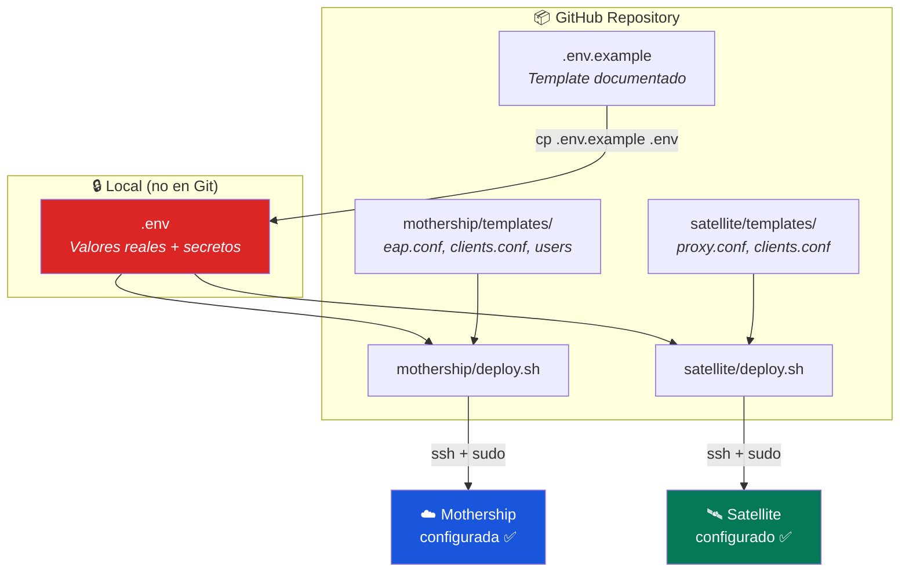

# Guía de Despliegue Automatizado

> **Objetivo:** Desplegar Mothership y Satellites desde cero con un solo comando  
> **Requisitos:** Ubuntu 24.04 LTS, acceso root, conexión a Internet  
> **Tiempo estimado:** ~5 minutos por servidor

---

## Arquitectura del Deploy



---

## 1. Configurar Variables

```bash
cd deploy/
cp .env.example .env
nano .env
```

### Variables principales

| Variable | Descripción | Ejemplo |
|---|---|---|
| `MOTHERSHIP_IP` | Elastic IP de la Mothership en AWS | `54.166.108.154` |
| `CERT_MODE` | `temp` (autofirmados) o `production` (Azure Cloud PKI) | `temp` |
| `EAP_DEFAULT_TYPE` | `peap` (usuario/contraseña) o `tls` (certificados) | `peap` |
| `SAT_PUBLIC_IP` | IP pública del Satellite (como la ve la Mothership) | `190.239.28.70` |
| `SAT_LOCAL_IP` | IP local del Satellite en el campus | `192.168.62.82` |
| `SECRET_SATELLITE_MOTHERSHIP` | Secreto Satellite ↔ Mothership | *(generado)* |
| `SECRET_AP_SATELLITE` | Secreto APs ↔ Satellite | *(generado)* |
| `AP_SUBNET` | Subred de los Access Points | `192.168.62.0/24` |

> [!CAUTION]
> **El archivo `.env` contiene secretos.** Está en `.gitignore` y NUNCA debe subirse a Git.

### Generar secretos seguros

```bash
# Generar un secreto aleatorio de 32 caracteres
dd if=/dev/random bs=1 count=24 2>/dev/null | base64
```

---

## 2. Desplegar la Mothership

```bash
# Opción A: Directamente en el servidor AWS
git clone https://github.com/UPeU-CRAI/upeu-mothership-radius.git
cd upeu-mothership-radius/deploy
cp .env.example .env
nano .env                           # ← completar valores
sudo bash mothership/deploy.sh
```

```bash
# Opción B: Desde tu máquina local via SCP
scp -r deploy/ ubuntu@54.166.108.154:/tmp/deploy/
ssh ubuntu@54.166.108.154
cd /tmp/deploy
cp .env.example .env
nano .env
sudo bash mothership/deploy.sh
```

### Qué hace el script

| Paso | Acción |
|---|---|
| 1 | Valida que todas las variables estén definidas |
| 2 | Instala FreeRADIUS si no existe |
| 3 | Genera certificados temporales o verifica los de producción |
| 4 | Genera parámetros Diffie-Hellman (si no existen) |
| 5 | Crea directorio de caché TLS |
| 6 | Respalda la configuración actual |
| 7 | Aplica templates (reemplaza `%%VARIABLES%%` con valores del `.env`) |
| 8 | Habilita módulo mschap |
| 9 | Valida con `freeradius -CX` |
| 10 | Reinicia el servicio |

### Salida esperada

```
[✓] Variables cargadas desde .env
[✓] Variables validadas
[✓] FreeRADIUS ya instalado
[✓] Modo: certificados TEMPORALES (autofirmados)
[✓] Parámetros DH ya existen
[✓] Directorio de caché TLS listo
[✓] Respaldo guardado en /etc/freeradius/3.0/backup-20260304-073500
[✓] EAP configurado (modo: temp, tipo: peap)
[✓] Clients configurado (satellite: SAT-LIMA-01 @ 190.239.28.70)
[✓] Users configurado (test: test1)
[✓] Módulo mschap habilitado
[✓] Configuración validada ✅
[✓] FreeRADIUS reiniciado y habilitado

============================================================================
 MOTHERSHIP desplegada exitosamente
============================================================================
```

---

## 3. Desplegar un Satellite

```bash
# Copiar el directorio deploy al Satellite
scp -r deploy/ freeradius@192.168.62.82:/tmp/deploy/
ssh freeradius@192.168.62.82
cd /tmp/deploy
cp .env.example .env
nano .env                           # ← completar valores
sudo bash satellite/deploy.sh
```

### Salida esperada

```
[✓] Variables cargadas desde .env
[✓] Variables validadas
[✓] FreeRADIUS ya instalado
[✓] Respaldo guardado en /etc/freeradius/3.0/backup-20260304-074000
[✓] Proxy configurado (mothership: 54.166.108.154)
[✓] Clients configurado (APs: 192.168.62.0/24)
[✓] Configuración validada ✅
[✓] FreeRADIUS reiniciado y habilitado

============================================================================
 SATELLITE desplegado exitosamente
============================================================================
```

---

## 4. Verificar el Despliegue

### Desde el Satellite

```bash
# Test del tunnel Satellite → Mothership
radtest test1 2026 127.0.0.1 0 testing123
# Esperado: Access-Accept
```

### Desde un dispositivo

1. Conectar a la red WiFi `UPeU-Secure`
2. Usuario: `test1` / Contraseña: `2026`
3. Aceptar certificado del servidor

---

## 5. Agregar una Nueva Sede

Para desplegar un Satellite en otra sede (ej: Juliaca):

```bash
# 1. Copiar .env y cambiar las variables de la sede
cp .env .env.juliaca
nano .env.juliaca
```

Cambiar:

```ini
SAT_NAME=SAT-JULIACA-01
SAT_SHORTNAME=SAT-JULIACA-01
SAT_PUBLIC_IP=<IP_PUBLICA_JULIACA>
SAT_LOCAL_IP=<IP_LOCAL_JULIACA>
AP_SUBNET=<SUBRED_APS_JULIACA>
AP_SHORTNAME=CAMPUS-JULIACA-APS
```

```bash
# 2. Copiar al nuevo servidor y desplegar
scp -r deploy/ usuario@<IP_JULIACA>:/tmp/deploy/
ssh usuario@<IP_JULIACA>
cd /tmp/deploy
cp .env.juliaca .env
sudo bash satellite/deploy.sh

# 3. En la Mothership: agregar el nuevo Satellite como cliente
# (Agregar otra entrada client en clients.conf de la Mothership)
```

> [!IMPORTANT]
> Cada nuevo Satellite requiere también ser registrado como cliente en la Mothership. En el futuro, el deploy de Mothership podría soportar múltiples Satellites desde el `.env`.

---

## Templates y Variables

### Archivos generados por el deploy

| Template | Destino | Variables usadas |
|---|---|---|
| `mothership/templates/eap.conf` | `/etc/freeradius/3.0/mods-available/eap` | `EAP_DEFAULT_TYPE`, `CERT_*`, `TLS_*` |
| `mothership/templates/clients.conf` | `/etc/freeradius/3.0/clients.conf` | `SAT_NAME`, `SAT_PUBLIC_IP`, `SECRET_SATELLITE_MOTHERSHIP` |
| `mothership/templates/users` | `/etc/freeradius/3.0/users` | `TEST_USER`, `TEST_PASSWORD` |
| `satellite/templates/proxy.conf` | `/etc/freeradius/3.0/proxy.conf` | `MOTHERSHIP_IP`, `SECRET_SATELLITE_MOTHERSHIP`, `PROXY_*` |
| `satellite/templates/clients.conf` | `/etc/freeradius/3.0/clients.conf` | `AP_SUBNET`, `AP_SHORTNAME`, `SECRET_AP_SATELLITE` |

### Convención de placeholders

Los templates usan `%%VARIABLE%%` como placeholders (doble porcentaje) para evitar conflictos con la sintaxis `${...}` de FreeRADIUS.

---

→ **Siguiente paso:** Para CI/CD automatizado con GitHub Actions, ver la futura guía en `.github/workflows/`.
